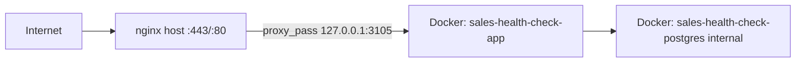

# دیپلوی Sales Health Check روی VPS

## وضعیت فعلی سرور (بررسی شده)

| مورد | وضعیت |
|------|--------|
| OS | Ubuntu، Docker 29 + Compose v5 |
| Reverse proxy | **nginx** روی پورت 80/443 (نه Caddy) |
| الگوی دیپلوی | `/opt/<project-name>/` + Docker Compose |
| پورت‌های backend | `3100`, `3102`, `3103`, `3104` اشغال — **`3105` آزاد** |
| DNS | `health.javidmgdm.com` → `193.163.201.132` (تأیید شما) |
| SSH | root با SSH key از سیستم شما |

**نکته مهم:** [`docker-compose.prod.yml`](docker-compose.prod.yml) فعلی سرویس **Caddy** دارد که پورت 80/443 را می‌گیرد و با nginx موجود **تداخل می‌کند**. برای این سرور از variant بدون Caddy استفاده می‌کنیم.

## معماری هدف



- postgres فقط داخل شبکه Docker (بدون expose به host)
- app فقط روی `127.0.0.1:3105` (مثل `delroba.javidmgdm.com` → `3104`)
- هیچ تغییری روی configهای nginx موجود — فقط **یک site جدید** اضافه می‌شود

## فایل‌های جدید در ریپو

### 1. [`docker-compose.nginx.yml`](docker-compose.nginx.yml)

کپی از [`docker-compose.prod.yml`](docker-compose.prod.yml) با این تغییرات:

- `name: sales-health-check` — جلوگیری از تداخل network/volume با `salesbot-*`
- **حذف کامل سرویس `caddy`** و volumeهای `caddy_*`
- bind پورت app: `127.0.0.1:${APP_PORT:-3105}:3000`
- اضافه کردن `PDF_GENERATION_ENABLED` به env (اختیاری، مطابق [`.env.production.example`](.env.production.example))

سرویس‌ها: `postgres` + `app` — entrypoint موجود ([`scripts/docker-entrypoint.sh`](scripts/docker-entrypoint.sh)) migration و seed را خودکار اجرا می‌کند.

### 2. [`deploy/nginx/health.javidmgdm.com.conf`](deploy/nginx/health.javidmgdm.com.conf)

الگو از config موجود `delroba.javidmgdm.com` روی سرور:

```nginx
server {
    server_name health.javidmgdm.com;
    client_max_body_size 25M;

    location / {
        proxy_pass http://127.0.0.1:3105;
        proxy_http_version 1.1;
        proxy_set_header Host $host;
        proxy_set_header X-Real-IP $remote_addr;
        proxy_set_header X-Forwarded-For $proxy_add_x_forwarded_for;
        proxy_set_header X-Forwarded-Proto $scheme;
    }

    listen 80;
}
```

SSL توسط **certbot** (مثل بقیه subdomainها) اضافه می‌شود — نه دستی.

### 3. [`scripts/deploy-to-vps.sh`](scripts/deploy-to-vps.sh)

اسکریپت deploy از سیستم local (چون git remote ندارید):

1. `rsync` پروژه به `root@193.163.201.132:/opt/sales-health-check/` (exclude: `node_modules`, `.next`, `.git`, `.env`)
2. SSH: اگر `.env` روی سرور نیست → از template بساز + secrets تولید کن
3. `docker compose -f docker-compose.nginx.yml up -d --build`
4. کپی nginx config → `sites-available` → symlink → `nginx -t`
5. `certbot --nginx -d health.javidmgdm.com --non-interactive --agree-tos -m <email>` (یا certonly اگر cert وجود داشت)
6. `systemctl reload nginx`
7. verify: `curl https://health.javidmgdm.com/api/health`

### 4. به‌روزرسانی [`docs/ops/production-deploy.md`](docs/ops/production-deploy.md)

بخش جدید **«Deploy with host nginx (multi-project VPS)»** — مرجع برای سرور فعلی و آینده.

---

## مراحل اجرا روی سرور

### مرحله A — آماده‌سازی secrets

روی سرور در `/opt/sales-health-check/.env`:

```env
POSTGRES_USER=postgres
POSTGRES_PASSWORD=<openssl rand -hex 24>
POSTGRES_DB=sales_health_check

APP_PORT=3105
APP_DOMAIN=health.javidmgdm.com
APP_BASE_URL=https://health.javidmgdm.com

EXPERT_VIEW_TOKEN=<openssl rand -hex 32>
CAPACITY_MODE=free
```

### مرحله B — Build و start Docker

```bash
cd /opt/sales-health-check
docker compose -f docker-compose.nginx.yml up -d --build
```

Build اولیه ~5–15 دقیقه (Next.js standalone + Playwright Chromium). لاگ: `docker compose -f docker-compose.nginx.yml logs -f app`

Healthcheck داخلی: `curl http://127.0.0.1:3105/api/health` → `{"status":"ok"}`

### مرحله C — nginx + SSL

```bash
cp deploy/nginx/health.javidmgdm.com.conf /etc/nginx/sites-available/
ln -sf /etc/nginx/sites-available/health.javidmgdm.com.conf /etc/nginx/sites-enabled/
nginx -t && systemctl reload nginx

certbot --nginx -d health.javidmgdm.com
nginx -t && systemctl reload nginx
```

### مرحله D — تأیید نهایی

- `curl -sS https://health.javidmgdm.com/api/health`
- باز کردن `https://health.javidmgdm.com` در مرورگر
- چک کردن که سرویس‌های دیگر سالم‌اند: `delroba.javidmgdm.com`, `salesplatform.javidmgdm.com`, n8n

---

## اقدامات ایمنی (جلوگیری از خراب شدن پروژه‌های دیگر)

1. **هیچ تغییری** روی configهای nginx موجود (`btk`, `n8n`, `salesbot`, `delroba`, `salesplatform`, `xray-ws`)
2. **بدون Caddy** — پورت 80/443 فقط nginx
3. **پورت 3105** — خارج از محدوده sales-bot (3100–3104)
4. **postgres بدون host port** — تداخل با `5432`/`5433` host ندارد
5. **`nginx -t` قبل از هر reload** — در صورت خطا، reload نمی‌شود
6. **Docker project name** جدا: `sales-health-check` (volume: `sales-health-check_postgres_data`)
7. **Backup** بعد از deploy اول: [`scripts/backup-db.sh`](scripts/backup-db.sh) + cron (مطابق [`docs/ops/database-backup.md`](docs/ops/database-backup.md))

---

## به‌روزرسانی‌های بعدی

```bash
# از local
./scripts/deploy-to-vps.sh

# یا دستی روی سرور
cd /opt/sales-health-check && git pull  # اگر remote اضافه شد
docker compose -f docker-compose.nginx.yml up -d --build
```

---

## ریسک‌ها و mitigation

| ریسک | راه‌حل |
|------|--------|
| Build طولانی / OOM | `--build` یک‌بار؛ در صورت کمبود RAM، swap یا build روی local + push image |
| certbot fail | DNS propagate؛ port 80 باز؛ `.well-known` از nginx |
| پورت 3105 اشغال | قبل از deploy: `ss -tlnp \| grep 3105` |
| EXPERT_VIEW_TOKEN خالی | app بالا می‌آید ولی `/expert/*` در prod → 401 |

---

## خروجی مورد انتظار

- `https://health.javidmgdm.com` — اپلیکیشن live
- `https://health.javidmgdm.com/api/health` — `200 {"status":"ok"}`
- postgres + app در Docker، nginx + SSL روی host
- سایر پروژه‌ها بدون تغییر
