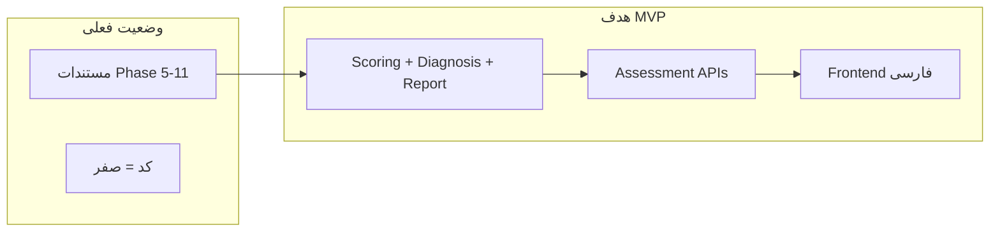
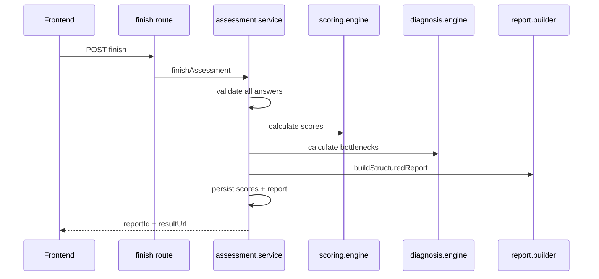
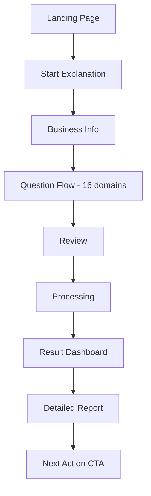

# برنامه توسعه MVP — Sales Health Check

## وضعیت فعلی


| بخش                                                                      | وضعیت                                      |
| ------------------------------------------------------------------------ | ------------------------------------------ |
| مستندات (PRD، معماری، API، Frontend Flow، Repository، ADR، Cursor Setup) | کامل                                       |
| کد، دیتابیس، تست                                                         | **وجود ندارد**                             |
| `[MVPBuildSprint.md](MVPBuildSprint.md)`                                 | خالی                                       |
| `[DomainDataModel.md](DomainDataModel.md)`                               | **ناقص** — فقط تا موجودیت `Domain` (خط ۹۶) |





## تصمیم‌های MVP (بر اساس انتخاب شما)

- **زبان:** فارسی — UI، سوالات Evidence-Based، گزارش Rule-Based
- **AI:** فعلاً **بدون AI** — فقط Report Engine با قالب‌های از پیش تعریف‌شده؛ معماری `[src/modules/ai/](RepositoryArchitecture.md)` آماده باشد ولی پیاده‌سازی نشود
- **Auth:** `resultToken` روی AssessmentSession (پیشنهاد `[APIDesign.md](APIDesign.md)`) — بدون login
- **Question Flow:** Domain-by-Domain (ADR 0009)
- **Finish:** synchronous در MVP — async فقط اگر finish > ۵ ثانیه شد

## اصل معماری (خط قرمزها)

از `[CursorExecutionSetup.md](CursorExecutionSetup.md)` و ۹ ADR در `[ADRSystem.md](ADRSystem.md)`:

1. **Diagnostic First** — Rule Engine تصمیم می‌گیرد، نه AI
2. **Backend = Source of Truth** — Frontend فقط `selectedOptionId` می‌فرستد
3. **Overall Score** = `Overall Raw / Overall Max × 100` — نه میانگین درصد دامنه‌ها
4. **ModelVersion** — هر Assessment به نسخه مدل قفل می‌شود
5. **Score Snapshot** — امتیاز در Answer ذخیره می‌شود
6. **Report Persist** — گزارش در DB ذخیره می‌شود
7. **Route handlers نازک** — منطق در `[src/modules/](RepositoryArchitecture.md)`

---

## فاز ۰ — آماده‌سازی Repository (۱–۲ روز)

### کارها

1. **Scaffold پروژه Next.js 14+ App Router**
  - TypeScript، Tailwind CSS، ESLint
  - ساختار مطابق `[RepositoryArchitecture.md](RepositoryArchitecture.md)`:

```
sales-health-check/
  docs/          ← انتقال ۸ فایل فعلی
  docs/adr/      ← ۹ ADR به فایل‌های جدا
  prisma/
  src/app/       ← pages + api routes
  src/modules/   ← assessment, question-bank, scoring, diagnosis, report
  src/components/
  src/lib/
  src/types/
  src/config/model-v1/
  src/tests/
  .cursor/rules/project-rules.md
```

1. **Cursor Rules** — کپی متن از `[CursorExecutionSetup.md](CursorExecutionSetup.md)` بخش ۵
2. **Env و زیرساخت**
  - `.env.example`: `DATABASE_URL`
  - `src/lib/db.ts`, `src/lib/env.ts`, `src/lib/errors.ts`
  - PostgreSQL local (Docker) یا Neon/Supabase
3. **تکمیل DomainDataModel → Prisma Schema**

موجودیت‌های لازم (استنتاج از `[APIDesign.md](APIDesign.md)` + `[SystemArchitecture.md](SystemArchitecture.md)`):

```prisma
// موجودیت‌های کلیدی
User, Organization
ModelVersion, Domain, Question, QuestionOption
AssessmentSession (status, modelVersionId, resultToken)
Answer (questionId, selectedOptionId, scoreSnapshot)
DomainScore, LayerScore, OverallScore
Bottleneck, Diagnosis
Report (structuredReport JSON, reportStatus)
```

**وضعیت AssessmentSession:** `started | in_progress | completed`

---

## فاز ۱ — Question Bank و Seed (۲–۳ روز)

### کارها

1. **Seed ModelVersion v1** — `prisma/seed.ts`
  - ۱۶ دامنه با وزن‌های PRD (`[PRD01.md](PRD01.md)` بخش ۹)
  - ۴ لایه (Layer 1–4) با `displayOrder`
  - **۵ سوال Evidence-Based به ازای هر دامنه** 
  - هر سوال ۴ گزینه با score ۰–۳
2. **Config files** در `src/config/model-v1/`:
  - `domains.ts` — نام فارسی، وزن، layer
  - `questions.ts` — متن سوال + گزینه‌ها
  - `diagnostic-rules.ts` — قوانین لایه و action plan
  - `report-templates.ts` — متن‌های Rule-Based
3. **ماژول question-bank**
  - `loadActiveModelVersion()`
  - `loadQuestionsForAssessment(assessmentId)`
  - validation: question/option متعلق به modelVersion

### وابستگی محتوایی (ریسک)

متن سوالات در مستندات **نمونه** دارد، نه بانک کامل. قبل از seed باید:

- یا محتوای ۱۶ دامنه نوشته شود
- یا با placeholder شروع و تدریجی تکمیل شود

---

## فاز ۲ — Core Engines + تست (۳–۴ روز)

**قبل از UI** — طبق `[CursorExecutionSetup.md](CursorExecutionSetup.md)` بخش ۱۳

### 2.1 Scoring Engine — `src/modules/scoring/scoring.engine.ts`

Pure functions (بدون DB):

```typescript
calculateDomainScores(answers, domains) → DomainScore[]
calculateLayerScores(domainScores, layers) → LayerScore[]
calculateOverallScore(answers) → { raw, max, percentage, healthLevel }
prepareSpiderChartData(domainScores) → chartData
```

**Health Level:** ۰–۲۵ بحرانی، ۲۶–۵۰ ضعیف، ۵۱–۷۵ متوسط، ۷۶–۱۰۰ سالم

**تست‌های اجباری** (`src/tests/scoring/`):

- Overall Score ≠ میانگین درصد دامنه‌ها
- دامنه با تعداد سوال متفاوت
- edge case: همه ۰، همه ۳

### 2.2 Diagnosis Engine — `src/modules/diagnosis/diagnosis.engine.ts`

```typescript
WeaknessScore = 100 - DomainPercentage
BottleneckPriority = WeaknessScore × DomainWeight
→ top 3 bottlenecks
→ layer status (سالم/قابل بهبود/ضعیف/بحرانی)
```

**تست‌های اجباری:**

- Persona با درصد بهتر ولی وزن ۱.۴ > دامنه با درصد پایین‌تر
- دقیقاً ۳ bottleneck

### 2.3 Report Builder — `src/modules/report/report.builder.ts`

بدون AI — خروجی ساختاریافته:

- `overallSummary` — از template + healthLevel
- `layerSummaries` — ۴ لایه
- `bottleneckSummaries` — ۳ گلوگاه با اثر روی فروش
- `actionPlans.sevenDay` — اقدام فوری
- `actionPlans.thirtyDay` — اقدام ساختاری

متن‌ها از `report-templates.ts` + جایگذاری داده تشخیص

---

## فاز ۳ — Backend APIs (۳–۴ روز)

### ماژول assessment — `src/modules/assessment/`


| Endpoint                                   | مسئولیت                                                  |
| ------------------------------------------ | -------------------------------------------------------- |
| `POST /api/assessments/start`              | User + Org + Session + active ModelVersion + resultToken |
| `GET /api/assessments/:id`                 | status + progress                                        |
| `GET /api/assessments/:id/questions`       | سوالات از modelVersion session                           |
| `POST /api/assessments/:id/answers`        | upsert Answer + score snapshot                           |
| `PATCH /api/assessments/:id/business-info` | ویرایش org                                               |
| `POST /api/assessments/:id/finish`         | scoring → diagnosis → report → persist                   |
| `GET /api/assessments/:id/result`          | payload کامل برای dashboard                              |
| `GET /api/reports/:reportId`               | گزارش + token check                                      |


### finishAssessment flow (حیاتی)




**قوانین:**

- finish idempotent — اگر completed، همان reportId برگردد
- answer upsert — تغییر پاسخ = update نه insert جدید
- error shape یکسان: `{ error: { code, message, details } }`

### تست API

- `finishAssessment` happy path
- incomplete assessment → 400
- invalid option → 409

---

## فاز ۴ — Frontend فارسی (۴–۵ روز)

مسیر کاربر از `[FrontendFlow.md](FrontendFlow.md)`:




### صفحات و API mapping


| صفحه          | Route                                      | API                         |
| ------------- | ------------------------------------------ | --------------------------- |
| Landing       | `/`                                        | —                           |
| Start         | `/assessment/start`                        | —                           |
| Business Info | `/assessment/start/info`                   | POST start                  |
| Questions     | `/assessment/[id]/questions/[domainIndex]` | GET questions, POST answers |
| Review        | `/assessment/[id]/review`                  | GET assessment              |
| Processing    | `/assessment/[id]/processing`              | POST finish                 |
| Result        | `/assessment/[id]/result?token=`           | GET result                  |
| Report        | `/report/[reportId]?token=`                | GET report                  |


### کامپوننت‌های کلیدی

- `components/charts/SpiderChart.tsx` — Recharts RadarChart، ۱۶ دامنه
- `components/assessment/DomainQuestionForm.tsx` — گزینه‌های Evidence-Based
- `components/assessment/ProgressBar.tsx` — progress کلی + دامنه
- `components/report/BottleneckCard.tsx`, `ActionPlanSection.tsx`
- `components/layout/PageLayout.tsx` — mobile-first

### UX اجباری

- ذخیره پاسخ هنگام رفتن به دامنه بعد
- پیام خطای واضح اگر save fail شد
- loading states: questions, saving, generating
- Review قبل از finish — کاربر بخش ناقص را ببیند

---

## فاز ۵ — یکپارچه‌سازی و QA (۲ روز)

### ۵ سناریوی تست دستی (از PRD Definition of Done)

1. کاربر جدید — تکمیل کامل → گزارش با ۳ bottleneck
2. پاسخ ناقص → Review نشان دهد، finish رد شود
3. تغییر پاسخ قبل از finish → score به‌روز شود
4. revisit result با token → همان گزارش
5. finish دوباره (idempotent) → همان reportId

### تست خودکار

- Unit: scoring + diagnosis (فاز ۲)
- Integration: finish flow
- TypeScript strict — بدون error

### Deploy

- Vercel + PostgreSQL managed (Neon/Supabase)
- env production
- seed production ModelVersion v1

---

## فاز ۶ — CTA و Polish (۱–۲ روز)

- صفحه CTA: «درخواست تحلیل دقیق‌تر گلوگاه فروش» (`[FrontendFlow.md](FrontendFlow.md)`)
- SEO پایه Landing
- README با دستور run local

**خارج از scope MVP:** AI، PDF، CRM، پرداخت، admin panel

---

## ترتیب اجرا در Cursor (feature-by-feature)

هر بار **یک feature کوچک** — نه «کل پروژه را بساز»:

```
1. Project setup + Prisma schema + migrate
2. Seed v1
3. Scoring engine + tests
4. Diagnosis engine + tests
5. Report builder
6. POST start + GET questions
7. POST answers
8. POST finish + GET result
9. Landing + Business Info
10. Question Flow (domain-by-domain)
11. Review + Processing
12. Result Dashboard + Spider Chart
13. Detailed Report + CTA
14. QA + Deploy
```

---

## تخمین زمان


| فاز                    | مدت تقریبی          |
| ---------------------- | ------------------- |
| ۰ Setup                | ۱–۲ روز             |
| ۱ Seed + Question Bank | ۲–۳ روز             |
| ۲ Engines + Tests      | ۳–۴ روز             |
| ۳ APIs                 | ۳–۴ روز             |
| ۴ Frontend             | ۴–۵ روز             |
| ۵ QA + Deploy          | ۲ روز               |
| ۶ Polish               | ۱–۲ روز             |
| **جمع**                | **~۱۶–۲۲ روز کاری** |


*بیشترین ریسک زمان: نوشتن محتوای ۵۰+ سوال Evidence-Based به فارسی*

---

## Definition of Done (MVP)

از `[PRD01.md](PRD01.md)` بخش ۱۴:

- Landing + فرم کامل Health Check
- پاسخ‌ها در DB + score snapshot
- امتیاز ۱۶ دامنه + Overall + Spider Chart
- ۳ bottleneck + ۴ لایه
- گزارش Rule-Based + action plan ۷ و ۳۰ روزه
- revisit result با token
- ۵ سناریوی تست دستی
- deploy قابل استفاده برای ۳۰+ کاربر واقعی

---

## کارهای پیش از شروع کدنویسی

1. تکمیل `[DomainDataModel.md](DomainDataModel.md)` یا مستقیم Prisma schema بنویس
2. ADRها را از `[ADRSystem.md](ADRSystem.md)` به `docs/adr/0001-*.md` تفکیک کن
3. شروع نوشتن بانک سوالات فارسی (حداقل ۳ سوال × ۱۶ دامنه = ۴۸ سوال)
4. پر کردن `[MVPBuildSprint.md](MVPBuildSprint.md)` با این برنامه

