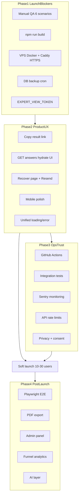
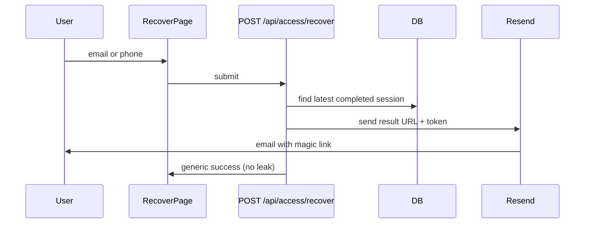

# نقشه راه Publish — Sales Health Check

## تصمیم‌های ثابت

- **Deploy:** VPS شخصی + [docker-compose.prod.yml](docker-compose.prod.yml) (طبق [README.md](README.md))
- **بازیابی لینk:** ارسال واقعی ایمیل با **Resend** + صفحه بازیابی
- **معماری:** Route نازک → `src/modules/*`؛ تست برای هر تغییر در `finishAssessment` / recovery



---

## Phase 1 — Must-have قبل از publish (Items 1–5)

**هدف:** یک deploy production پایدار با validation دستی و امنیت حداقلی.

### Item 1 — QA دستی (۶ سناریو)

- اجرای [docs/qa/MVP-Manual-Test-Scenarios.md](docs/qa/MVP-Manual-Test-Scenarios.md) روی **staging VPS** (نه فقط localhost)
- خروجی: فایل checklist جدید `docs/qa/MVP-QA-Run-Log.md` با تاریخ، محیط، pass/fail هر سناریو، باگ‌های یافت‌شده
- سناریوهای حیاتی: **4 (revisit token)**، **5 (idempotent finish)**، **2 (incomplete block)**
- باگ‌های UI/backend قبل از deploy fix شوند

### Item 2 — Production build

```bash
npm test && npm run build
```

- اگر build fail شد: معمولاً type error، import server-only در client، یا env در build time — fix در همان PR
- CI در Phase 3 همین را خودکار می‌کند؛ الان دستی gate است

### Item 3 — Deploy VPS + HTTPS (Caddy)

**وضعیت فعلی:** [docker-compose.prod.yml](docker-compose.prod.yml) فقط `app` + `postgres` دارد؛ envهای `EXPERT_VIEW_TOKEN`، `CAPACITY_MODE`، `RESEND_*` پاس نمی‌شوند.

**کارها:**

1. **تکمیل env production**
   - به [.env.production.example](.env.production.example) اضافه: `EXPERT_VIEW_TOKEN`, `CAPACITY_MODE`, `RESEND_API_KEY`, `EMAIL_FROM`, `APP_BASE_URL`
   - در `docker-compose.prod.yml` → `app.environment` این متغیرها را pass کن

2. **Reverse proxy + TLS**
   - سرویس Caddy در `docker-compose.prod.yml` یا `docker-compose.caddy.yml`
   - Caddyfile نمونه: domain → `app:3000`، auto HTTPS با Let's Encrypt
   - مستند deploy: `docs/ops/production-deploy.md` (DNS A record، firewall 80/443، `APP_PORT` internal)

3. **Healthcheck**
   - endpoint سبک `GET /api/health` (جدید) برای Caddy/monitoring
   - `depends_on` postgres موجود است؛ healthcheck برای `app` اضافه شود

4. **Deploy flow**
   ```bash
   git pull && docker compose -f docker-compose.prod.yml up -d --build
   ```

### Item 4 — Backup DB

- اسکریپت: `scripts/backup-db.sh` (wrap `pg_dump` از container postgres)
- restore doc در `docs/ops/database-backup.md`
- cron نمونه روی VPS: روزانه + نگه‌داشت ۷ نسخه
- **قبل از اولین کاربر واقعی:** یک backup + یک restore test روی DB موقت

### Item 5 — EXPERT_VIEW_TOKEN

- کد موجود در [src/modules/assessment/assessment.service.ts](src/modules/assessment/assessment.service.ts) (`getExpertView`): در production بدون token → 401
- فقط تنظیم env روی سرور + مستند در README
- تست دستی: `/expert/[id]?adminToken=wrong` → 401

**خروجی Phase 1:** staging/production روی HTTPS، QA log سبز، backup فعال.

---

## Phase 2 — UX محصول واقعی (Items 6–10)

**هدف:** کاربر لینk را گم نکند، ارزیابی را ادامه دهد، تجربه موبایل قابل تحمل باشد.

### Item 8 — Copy/Share لینk (سریع، قبل از email)

- در [src/app/assessment/[id]/result/page.tsx](src/app/assessment/[id]/result/page.tsx) و [processing/page.tsx](src/app/assessment/[id]/processing/page.tsx):
  - نمایش URL کامل با `buildResultUrl` از [assessment.validators.ts](src/modules/assessment/assessment.validators.ts)
  - دکمه «کپی لینk» (`navigator.clipboard`) + toast موفقیت
  - هشدار: «این لینk را ذخیره کنید — راه دیگری برای ورود ندارید» (تا email recovery آماده شود)

### Item 7 — Resume ارزیابی ناتمام

**مشکل:** [questions page](src/app/assessment/[id]/questions/[domainIndex]/page.tsx) فقط از [sessionStorage](src/lib/assessment-storage.ts) می‌خواند؛ DB پاسخ دارد ولی UI hydrate نمی‌شود.

**Backend:**

- `GET /api/assessments/[assessmentId]/answers`
- Service جدید در [assessment.service.ts](src/modules/assessment/assessment.service.ts): فقط برای `status !== completed`؛ خروجی `{ answers: [{ questionId, selectedOptionId }] }`
- Repository: reuse `getAnswersWithDetails` در [assessment.repository.ts](src/modules/assessment/assessment.repository.ts)
- تست unit در [assessment.service.test.ts](src/tests/assessment/assessment.service.test.ts)

**Frontend:**

- در questions + [review/page.tsx](src/app/assessment/[id]/review/page.tsx): بعد از load، merge API answers → `saveAnswers` → state
- صفحه `/assessment/resume` (اختیاری): ورود با `assessmentId` از bookmark

### Item 6 — بازیابی لینk با ایمیل (Resend)



**Backend — ماژول جدید `src/modules/access-recovery/`:**

- `POST /api/access/recover` — body: `{ email?: string, phone?: string }`
- Logic:
  1. normalize email/phone (همان منطق [startAssessment](src/modules/assessment/assessment.service.ts))
  2. پیدا کردن User → آخرین `AssessmentSession` با `status=completed`
  3. ساخت URL: `${APP_BASE_URL}/assessment/${id}/result?token=${resultToken}`
  4. ارسال ایمیل فارسی با Resend
- **امنیت:** همیشه پاسخ یکسان («اگر ارزیابی completed دارید، ایمیل ارسال شد») — جلوگیری از user enumeration
- Rate limit: 3 req / 15 min / IP (Phase 3 formalize؛ در Phase 2 حداقل in-memory)

**Frontend:**

- `/recover` — فرم ایمیل/موبایل + لینk از footer/result error state

**Env:**

- `RESEND_API_KEY`, `EMAIL_FROM` (مثلاً `noreply@yourdomain.com`), `APP_BASE_URL=https://...`
- وابستگی: `resend` npm package

**تست:** mock Resend در unit test؛ سناریوی QA جدید (Scenario 7) در QA doc

### Item 9 — Mobile polish

فایل‌های هدف (حداقل تغییر، بیشترین اثر):

| فایل | بهبود |
|------|--------|
| [DomainQuestionForm.tsx](src/components/assessment/DomainQuestionForm.tsx) | tap target ≥44px، spacing گزینه‌ها |
| [questions/.../page.tsx](src/app/assessment/[id]/questions/[domainIndex]/page.tsx) | sticky footer «بعدی/قبلی» |
| [ProgressBar.tsx](src/components/assessment/ProgressBar.tsx) | «دامنه X از 16» + درصد |
| [PageLayout.tsx](src/components/layout/PageLayout.tsx) | padding موبایل، safe-area |
| Report blocks | `max-w` و chart height responsive در [ChartsSection.tsx](src/components/report/blocks/ChartsSection.tsx) |

### Item 10 — Loading/error یکدست

- الگوی موجود: [LoadingSpinner](src/components/ui/LoadingSpinner.tsx), [ErrorMessage](src/components/ui/ErrorMessage.tsx)
- Audit همه `"use client"` pages در `src/app/assessment/**` و `src/app/report/**`
- یک `PageState` wrapper (loading | error | content) برای حذف duplicate patterns
- پیام‌های فارسی یکسان برای 403 token، 404، network error

**خروجی Phase 2:** soft launch با copy link + email recovery + resume cross-device.

---

## Phase 3 — اعتماد و عملیات (Items 11–15)

### Item 11 — CI pipeline

فایل: `.github/workflows/ci.yml`

```yaml
jobs:
  ci:
    runs-on: ubuntu-latest
    services:
      postgres: ...
    steps:
      - npm ci
      - npx prisma migrate deploy
      - npm test
      - npm run build
```

- Trigger: `push` به main + `pull_request`
- Node 20، cache npm
- Secret لازم نیست برای unit tests؛ integration test از service postgres در workflow

### Item 12 — Integration test

- `vitest.integration.config.ts` + `src/tests/integration/finish-assessment.integration.test.ts`
- DB test واقعی: seed minimal یا fixture؛ flow: start → save answers (mock 80) → finish → assert report + reportSpec
- در CI با postgres service container
- **قانون پروژه:** هر تغییر در `finishAssessment` باید این تست را pass کند

### Item 13 — Monitoring (Sentry)

- `@sentry/nextjs` — `sentry.client.config.ts`, `sentry.server.config.ts`
- env: `SENTRY_DSN` (فقط production)
- Capture: unhandled API errors در [api-handler.ts](src/lib/api-handler.ts) + client boundary
- Alert: email Sentry روی error spike

### Item 14 — Rate limiting

- `src/lib/rate-limit.ts` — in-memory sliding window (کافی برای single VPS instance)
- Wrap در routes حساس:
  - `POST /api/access/recover` — 3/15min/IP
  - `POST /api/consultation-requests` — 5/hour/IP
  - `POST /api/assessments/start` — 10/hour/IP
- پاسخ: `429` + `retry_after`
- تست unit برای limiter

### Item 15 — Privacy policy + consent

- صفحه `/privacy` — فارسی، جمع‌آوری name/email/phone، retention، contact
- Checkbox consent در:
  - [start/info/page.tsx](src/app/assessment/start/info/page.tsx)
  - [ConsultationForm.tsx](src/components/assessment/ConsultationForm.tsx)
- فیلد اختیاری `consentedAt` روی User یا AssessmentSession (migration کوچک) — یا log در consultation record
- لینk privacy در footer [PageLayout](src/components/layout/PageLayout.tsx)

**خروجی Phase 3:** CI سبز، integration test، Sentry، rate limits، compliance پایه.

---

## Phase 4 — بعد از launch (Items 16–20)

### Item 16 — E2E Playwright

- `playwright.config.ts` + `e2e/scenario-1-full-flow.spec.ts` mirroring QA Scenario 1
- CI job جدا (optional nightly) — سنگین‌تر از unit tests
- `webServer` برای build + start

### Item 17 — PDF export

- Option A (MVP): `@react-pdf/renderer` server-side route `GET /api/reports/[id]/pdf?token=`
- Option B: puppeteer print report page
- فقط بعد از stabilizing report UI؛ RTL فارسی challenge — تست visual

### Item 18 — Admin panel

- Route `/admin/consultations?adminToken=` — reuse `EXPERT_VIEW_TOKEN` یا token جدا
- لیست `ConsultationRequest` + filter by date
- **نه** full CRUD — read-only dashboard برای follow-up leads

### Item 19 — Analytics

- Plausible یا PostHog (privacy-friendly)
- Events: `assessment_started`, `assessment_completed`, `report_viewed`, `cta_submitted`, `recover_requested`
- Funnel در dashboard provider

### Item 20 — AI layer

- طبق PRD: **بعد از launch** — architecture slot در `src/modules/ai/` (فعلاً خالی)
- فاز اول: enhance `aiGeneratedText` on Report با opt-in CTA
- نیاز ADR جدید قبل از پیاده‌سازی

---

## ترتیب اجرای پیشنهادی (Timeline)

| هفته | Items | Deliverable |
|------|-------|-------------|
| 1 | 1, 2, 3, 4, 5 | Production روی HTTPS + QA log |
| 2 | 8, 7, 10 | Resume + copy link + error states |
| 3 | 6, 9, 15 | Email recovery + mobile + privacy |
| 4 | 11, 12, 13, 14 | CI + integration + Sentry + rate limit |
| — | **Soft launch** | 10–30 کاربر واقعی |
| 5+ | 16–20 | E2E, PDF, admin, analytics, AI |

---

## فایل‌های کلیدی که تغییر می‌کنند

| حوزه | فایل‌ها |
|------|---------|
| Deploy/Ops | [docker-compose.prod.yml](docker-compose.prod.yml), [.env.production.example](.env.production.example), `docs/ops/*`, `scripts/backup-db.sh` |
| Recovery | `src/modules/access-recovery/*`, `src/app/recover/page.tsx`, `src/app/api/access/recover/route.ts` |
| Resume | `src/app/api/assessments/[id]/answers/route.ts`, questions/review pages |
| UX | result/processing pages, assessment components, PageLayout |
| Ops | `.github/workflows/ci.yml`, `src/lib/rate-limit.ts`, Sentry configs |
| Legal | `src/app/privacy/page.tsx`, consent in forms |

---

## ریسک‌ها و وابستگی‌ها

- **Resend:** نیاز به verify domain DNS قبل از ارسال production email
- **Cross-device resume:** بدون token روی in-progress API، هر کسی با `assessmentId` می‌تواند پاسخ ببیند — برای launch قابل قبول (مثل الان)؛ hardening بعداً با session token
- **Rate limit in-memory:** با restart از بین می‌رود — برای single VPS کافی؛ scale بعداً Redis
- **docker-compose.prod.yml** فعلاً env ناقص دارد — Item 3 blocker است
