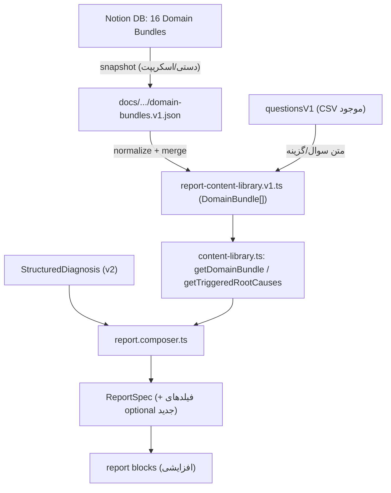

## Report Content Library v1 — انتقال به ورک‌اسپیس + پیاده‌سازی

### اصول حاکم بر کل پلن
- **همه‌چیز داخل ورک‌اسپیس**: محتوای Notion (راهنما + صفحهٔ Library + JSON هر ۱۶ دامنه) به‌صورت فایل در `docs/` و seed کد ذخیره می‌شود تا ایجنت‌های Claude بدون دسترسی به Notion کل کانتکست را داشته باشند.
- **افزایشی و بدون شکستن**: ساختار فعلی پروژه (`CSV → question-analysis-config → content-library.ts → report.composer.ts`) دست‌نخورده می‌ماند؛ DomainBundle یک لایهٔ محتوای جدید **روی** آن است. همهٔ فیلدهای جدید `ReportSpec` به‌صورت `optional` اضافه می‌شوند.
- **هم‌خوان با کد فعلی**: کد جدید در `src/config/model-v1/report-content/` و `src/modules/report/` قرار می‌گیرد (نه `src/features/...` که راهنما پیشنهاد داده).
- **Diagnosis Engine دست‌نخورده**: طبق ADR 0010، Report Engine هیچ تشخیص/امتیاز جدیدی نمی‌سازد.

### جریان داده (محل اتصال لایهٔ جدید)

### نگاشت‌های حیاتی (برای جلوگیری از خرابی)
- کراس‌واک بر اساس `domain_number` (Notion) == `displayOrder` (در [src/config/model-v1/domains.ts](src/config/model-v1/domains.ts))، نه رشتهٔ `engine_id`.
- نگاشت صریح slug: Notion `offer_pricing→offer-design`, `lead_response_capture→speed-to-lead`, `first_contact_trust→initial-trust`, `professional_presentation→presentation`, `sales_closing→closing`, `customer_loyalty→loyalty`, `sales_path_clarity→sales-journey-clarity`, `sales_measurement_optimization→measurement-optimization` (بقیه یکسان با تبدیل `_`→`-`).

### گپ‌های داده‌ای که در پیاده‌سازی مدیریت می‌شوند
- **D01–D04**: دادهٔ کامل در body صفحهٔ Notion است (propertyها خالی) → باید body هر صفحه fetch و در snapshot ذخیره شود.
- **D05–D16**: propertyها پر است ولی ساده‌تر از typeهای راهنما (`answer_options_json` خالی، `questions_json` فقط `{id,label}`، بدون `full_action_fa`).
- **نتیجه**: متن سوال/گزینه و `public_reflection` از `questionsV1` و `optionInterpretations` موجود گرفته می‌شود؛ محتوای جدید Notion (سطوح، ریشه‌ها، قواعد ریشه، اقدام/تیزر، نشانه‌ها) روی آن لایه می‌شود.

---

## فاز A — انتقال مستندات و داده به ورک‌اسپیس

1. ساخت پوشهٔ `docs/specs/report-content-library-v1/` شامل:
   - `cursor-implementation-guide.md` — متن کامل راهنمای Notion.
   - `overview.md` — متن صفحهٔ «Sales Health Check — Report Content Library v1» (قواعد public/internal، قرارداد نمایش ریشه).
   - `domain-bundles.v1.json` — snapshot خام هر ۱۶ ردیف (propertyها + body مربوط به D01–D04) به‌عنوان منبع رسمی داخل ریپو.
2. ثبت تصمیم: `docs/adr/0015-adopt-report-content-library-v1.md` (الگوی ADRهای موجود) — اتخاذ DomainBundle، رابطهٔ افزایشی با pipeline فعلی، قانون freemium و public/internal.
3. به‌روزرسانی شاخص‌ها برای دیده‌شدن توسط ایجنت‌ها: افزودن ارجاع به این داک‌ها در [.cursor/rules/project-rules.md](.cursor/rules/project-rules.md) و بخش docs در [README.md](README.md).
4. علامت‌گذاری گپ موجود: فایل ارجاع‌شدهٔ `docs/specs/report-engine-v1-spec.md` در ریپو نیست؛ در ADR 0015 به‌عنوان TODO ثبت می‌شود (خارج از این کار اصلی).

## فاز B — Types و Seed

5. types جدید در `src/config/model-v1/report-content/domain-bundle.types.ts`: `DomainBundle`, `DomainLevelContent`, `RootCauseContent`, `QuestionRootRule`, `ActionContent` (هم‌راستا با راهنما، با فیلدهای optional برای داده‌های ناقص).
6. کراس‌واک `domain_number ↔ project slug` در همان پوشه (با اتکا به `domainsV1`).
7. seed قطعی `src/config/model-v1/report-content/report-content-library.v1.ts` → `REPORT_CONTENT_LIBRARY_V1: DomainBundle[]` (۱۶ عضو)، normalize‌شده از `domain-bundles.v1.json` و merge‌شده با `questionsV1` برای متن سوال/گزینه.

## فاز C — Resolverها و Fallbackها

8. گسترش [src/modules/report/content-library.ts](src/modules/report/content-library.ts) با: `getDomainBundle`, `getDomainLevel`, `getSelectedAnswerOption`, `getTriggeredRootCauses` (اعمال شرط‌های ساده مثل `score<=1` از `question_root_rules`)؛ استفاده از `logMissingContent` فعلی.
9. گسترش [src/config/model-v1/report-content/field-fallbacks.ts](src/config/model-v1/report-content/field-fallbacks.ts) با fallbackهای راهنما (`missingRootCause`, `missingMechanism`, `missingSalesImpact`, `missingLockedTeaser`).

## فاز D — Composer (افزایشی)

10. افزودن فیلدهای **optional** به [src/types/report-spec.ts](src/types/report-spec.ts): `rootCauses?`, `levelHeadline?`, `lockedActionTeaser?`, `quickWinAction?` روی `DomainBreakdownEntry`.
11. گسترش `buildDomainBreakdown` در [src/modules/report/report.composer.ts](src/modules/report/report.composer.ts) برای پرکردن این فیلدها از bundle؛ قانون freemium: فقط دامنهٔ `quickWin` → `full_action`/quick win، بقیه فقط `locked_teaser`. تضمین عدم نشت `internal_diagnosis_summary_fa`/`rendering_rules_fa` به خروجی.

## فاز E — UI (افزایشی)

12. گسترش بلوک‌های موجود در `src/components/report/blocks/` (مثل DomainAnatomy و [QuickWinBlock.tsx](src/components/report/blocks/QuickWinBlock.tsx)) برای رندر فیلدهای جدید فقط در صورت وجود؛ بدون حذف رفتار فعلی.

## فاز F — تست‌ها

13. تست‌های قرارداد در `src/tests/report/` طبق ۹ سناریوی راهنما: عدم نشت فیلدهای internal، فعال‌شدن root cause درست با پاسخ ضعیف، نگاشت `selected_score`، نمایش `full_action` فقط برای quick win، `locked_teaser` برای بقیه، عدم رندر null/undefined، determinism، عدم محاسبهٔ مجدد امتیاز.
14. به‌روزرسانی snapshot موجود [src/tests/report/report.composer.snapshot.test.ts](src/tests/report/report.composer.snapshot.test.ts) (به‌دلیل فیلدهای جدید) و اجرای `npm test`.

## فاز G — Sync اختیاری
15. (اختیاری) اسکریپت `scripts/sync-report-content.ts` برای بازتولید seed از `domain-bundles.v1.json`؛ طبق راهنما برای MVP الزامی نیست.
