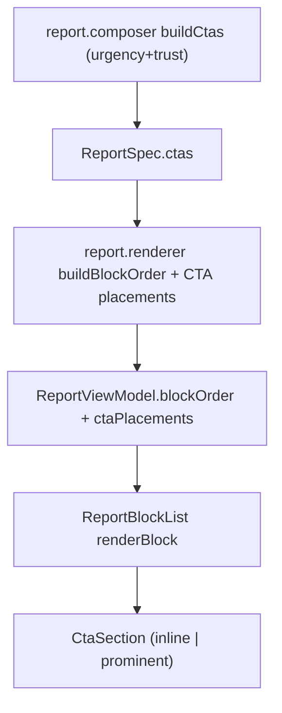

# بازچینش صفحه گزارش برای تولید سرنخ

## هدف
صفحه گزارش به جای حس «بررسی رایگان»، کاربر را به سمت «بهبود قیف فروش و دریافت برنامه/مشاوره» هدایت کند. CTAها نتیجه‌محور، تکرارشونده در نقاط درست، و قابل دیدن باشند. بخش «ارزش از دست‌رفته» به انتهای گزارش منتقل شود و نقش قلاب کنجکاوی بگیرد.

## محدوده (تأییدشده)
- اعمال روی هر دو واریانت: گزارش تفصیلی (`full`) و خلاصه نتیجه (`summary`) — هر دو از `buildBlockOrder` مشترک استفاده می‌کنند.
- مقصد کلیک CTA و متن صفحه فرم مشاوره (`src/app/assessment/[id]/cta/page.tsx`) بدون تغییر می‌ماند. فقط CTAهای داخل گزارش عوض می‌شوند.

## معماری فعلی (نقطه شروع)
- ترتیب بلاک‌ها در `buildBlockOrder` ساخته می‌شود و `ReportBlockList` هر بلاک را به کامپوننت نگاشت می‌کند.
- کامپوزر هر دو CTA (`urgency` + `trust`) را می‌سازد، اما `selectPrimaryCta` در renderer فقط یکی را در انتها نشان می‌دهد.
- متن دکمه از `ctaButtonLabels` («درخواست مشاوره رایگان») و تیترها از `ctaHeadlineTemplates` می‌آیند.

## ترتیب جدید بلاک‌ها

### گزارش تفصیلی (full)
1. `survival-banner`
2. `cta-top` (اینلاین، نتیجه‌محور و فوریتی) — جدید
3. `health-charts`
4. `cta-score` (اینلاین، متصل به عدد/وضعیت) — جدید
5. `issues`
6. `quick-win`
7. `domain-breakdown` (CTAهای کوچک قفل‌شده داخلش بازطراحی متن/ظاهر)
8. `locked-plan`
9. `confidence-note` (در صورت وجود)
10. `cta` (CTA اصلی نهایی، prominent)
11. `metrics-gate` (اگر عدد وارد نشده) یا `value-at-stake` (اگر وارد شده) — منتقل‌شده به انتها با متن کنجکاوی‌محور
12. `cta-value` (prominent، فقط وقتی `value-at-stake` موجود است) — جدید

### خلاصه نتیجه (summary)
1. `survival-banner`
2. `cta-top` (اینلاین) — جدید
3. `health-gauge`
4. `issues`
5. `quick-win`
6. `summary-actions` (مشاهده گزارش کامل + CTA مشاوره، حفظ می‌شود)
7. `value-stake-teaser` یا `value-at-stake` — منتقل به انتها با متن کنجکاوی‌محور
8. `cta-value` (وقتی value موجود است) — جدید

## تغییرات کد

### ۱. متن CTAها (نتیجه‌محور)
فایل: `src/config/model-v1/report-content/cta-templates.ts`
- `ctaButtonLabels` از «درخواست مشاوره رایگان» به متن نتیجه‌محور، مثل «دریافت مشاوره بهبود قیف فروش» یا «برنامه بهبود قیف فروشم را می‌خواهم».
- بازنویسی `ctaHeadlineTemplates` (`urgency` و `trust`) با زبان بهبود قیف، بدون تأکید بر «رایگان/بررسی».
- افزودن کپی نقاط جدید: `ctaTopCopy` (زیر وضعیت کلی)، `ctaScoreCopy` (زیر امتیاز/نمودار: «می‌خواهم قیف فروشم را از این وضعیت خارج کنم»)، `ctaAfterValueCopy` (بعد از ارزش از دست‌رفته: «برای کاهش این فروش از دست‌رفته، برنامه بهبود قیف فروشم را می‌خواهم»).

### ۲. متن قلاب کنجکاوی ارزش از دست‌رفته
- فرم ورودی: `src/components/report/blocks/BusinessMetricsGate.tsx`
  - عنوان: «می‌خواهی بدانی با همین قیف فروش چقدر پول از دست می‌دهی؟»
  - توضیح: «۴ عدد ساده را وارد کن تا تخمین بزنیم چه مقدار فروش بالقوه هر ماه از دست می‌رود.»
  - دکمه: «محاسبه فروش از دست‌رفته».
- تیزر خلاصه: `valueStakeTeaserBody` در `src/config/model-v1/report-content/tone-templates.ts` به همان لحن کنجکاوی‌محور.

### ۳. ترتیب و نقاط CTA در renderer
فایل: `src/modules/report/report.renderer.ts`
- افزودن block idها به `ReportBlockId`: `cta-top`, `cta-score`, `cta-value` (و حفظ `cta` به‌عنوان CTA نهایی).
- بازنویسی `buildBlockOrder` برای هر دو واریانت طبق ترتیب بالا، شامل انتقال `metrics-gate`/`value-at-stake`/`value-stake-teaser` به انتها و افزودن `cta-value` فقط وقتی `spec.valueAtStake` موجود است.
- ساخت کپی هر نقطه CTA در view model (مثلا فیلد `ctaPlacements` با تیتر/لیبل برای `top`, `score`, `final`, `afterValue`) با استفاده از دو CTA کامپوزر و کپی‌های جدید. CTA نهایی همان `trust` و CTA بالا همان `urgency` می‌ماند.

### ۴. رندر بلاک‌های جدید
فایل: `src/components/report/ReportBlockList.tsx`
- افزودن caseها برای `cta-top`, `cta-score`, `cta-value` که `CtaSection` را با کپی و واریانت مناسب رندر می‌کنند و `onCtaClick` را پاس می‌دهند.
- حفظ احترام به `presentation.hideInteractive` (حالت چاپ دکمه‌ها را مخفی می‌کند).

### ۵. واریانت‌های CtaSection
فایل: `src/components/report/blocks/CtaSection.tsx`
- افزودن prop `variant: "inline" | "prominent"` و دریافت `headline`/`buttonLabel` صریح.
- `inline`: نسخه فشرده‌تر و کم‌ارتفاع برای نقاط بالای صفحه؛ `prominent`: نسخه فعلی برجسته برای CTA نهایی و بعد از ارزش.

### ۶. CTAهای کوچک داخل حوزه‌های قفل‌شده
فایل: `src/components/report/blocks/DomainAnatomy.tsx`
- لینک‌های متنی فعلی «درخواست مشاوره برای دریافت راهکار» به یک دکمه/باکس کوچک‌تر و دیداری‌تر با متن بهبود قیف تبدیل شوند (همان `onFixLockClick`).

## تست‌ها
- `src/tests/report/report.renderer.test.ts`: به‌روزرسانی آرایه‌های ترتیب بلاک برای هر دو واریانت (full + summary) و انتظارات CTA.
- `src/tests/report/__snapshots__/report.composer.snapshot.test.ts.snap`: بازتولید snapshot به‌خاطر تغییر تیتر CTA در کامپوزر.
- `src/tests/report/report.composer.contract.test.ts`: بررسی/به‌روزرسانی در صورت assert روی متن CTA.
- اجرای `npm test` برای واحدها.

## ملاحظات
- CTAهای بالای صفحه باید کوتاه و کم‌مزاحمت باشند؛ هر نقطه متن متفاوت و متصل به همان بخش داشته باشد (نه تکرار عینی).
- مشاوره به‌عنوان «مسیر ورود به بهبود قیف فروش» معرفی شود، نه محصول نهایی.
- در حالت چاپ، CTAهای تعاملی همچنان مخفی می‌مانند.