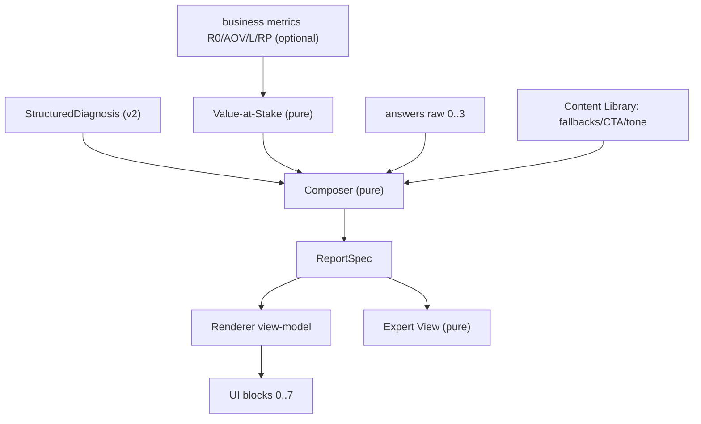

## Report Engine v1 — برنامه اجرا

منبع قرارداد: [docs/specs/report-engine-v1-spec.md](docs/specs/report-engine-v1-spec.md). هم‌راستا با [.cursor/rules/project-rules.md](.cursor/rules/project-rules.md) و [docs/adr/0010-separate-diagnosis-from-report-engine.md](docs/adr/0010-separate-diagnosis-from-report-engine.md).

خط قرمزها (از قوانین پروژه): Backend = source of truth، Frontend فقط نمایش، Report Engine هیچ تصمیم تشخیصی نمی‌گیرد، هر تغییر در `finishAssessment` باید تست داشته باشد، و تضاد با ADR = نیاز به ADR جدید (این کار ADR 0013 می‌گیرد).

### معماری جریان

### فاز ۰ — ADR و فعال‌سازی Diagnosis v2
- نوشتن `docs/adr/0013-report-engine-v1.md` (تصمیم: Composer/Narrator/Value-at-Stake، ReportSpec قرارداد میانی، capacity_mode از env، طبقه ۲ کیفی در v1).
- فعال‌سازی v2 در [prisma/seed.ts](prisma/seed.ts): تغییر `diagnosisEngineVersion: "v1"` به `"v2"` (خط ۴۶). نیازمند re-seed دیتابیس dev.
- بدون تغییر کد موتور تشخیص؛ `runDiagnosis` در [src/modules/diagnosis/facade.ts](src/modules/diagnosis/facade.ts) از قبل v2 و `structuredDiagnosis` می‌دهد.

### فاز ۱ — قراردادها (types + schema)
- `src/types/report-spec.ts` — interface کامل `ReportSpec` طبق پیوست A اسپک (survivalBanner, charts, quickWinTeaser, issues, domainBreakdown, valueAtStake, quickWin, lockedPlan, ctas, capacityMode, confidenceNote, expertView).
- `src/types/value-at-stake.ts` — ورودی `{ R0, AOV, L, RP? }` و خروجی `ValueAtStakeSpec`.
- Prisma ([prisma/schema.prisma](prisma/schema.prisma)):
  - افزودن متریک‌ها به `AssessmentSession` (هم‌بسته با snapshot گزارش): `monthlyRevenue`, `averageOrderValue`, `monthlyLeads`, `repeatPurchaseRate` (همه `Float?`).
  - افزودن `reportSpec Json?` به مدل `Report` (نگه‌داشتن `structuredReport` فعلی برای سازگاری در دوره مهاجرت).
  - `npx prisma migrate dev` برای migration جدید.

### فاز ۲ — Content Library (M3)
- `src/config/model-v1/report-content/field-fallbacks.ts` — طبق پیوست B (`FieldFallbacks` بر اساس `DomainLevel`).
- `src/config/model-v1/report-content/cta-templates.ts` و `tone-templates.ts` — متن CTA و لحن بر اساس `survivalStatus`/`confidence`.
- `src/lib/missing-content-log.ts` — ثبت fallbackهای فعال‌شده (در dev: `console.warn`).
- مصرف متون موجود از [src/config/model-v1/question-analysis-config.ts](src/config/model-v1/question-analysis-config.ts) (`diagnosticSymptoms`, `diagnosticIntent`, `optionInterpretations`, `domainScoreBands`, `correctiveAction`).

### فاز ۳ — Value-at-Stake engine (pure + tests)
- `src/modules/report/value-at-stake.engine.ts`:
  - استخراج CR0/F0، گام ۳ پتانسیل با مرزهای فیزیکی (CR ≤ 1، epsilon برای H=0)، تجزیه طبقه ۱، طبقه ۲ کیفی، طبقه ۳ مشروط.
  - نگاشت اهرم↔دامنه فقط با `engine_id` از [src/config/model-v1/diagnosis-engine-v2/domain-crosswalk.ts](src/config/model-v1/diagnosis-engine-v2/domain-crosswalk.ts).
  - ورودی ناقص → `null` (نه عدد غلط).
- `src/tests/report/value-at-stake.test.ts` — edge cases اسپک (F0=1، H=0، CR cap، گیت رد).

### فاز ۴ — Composer + Renderer (pure + snapshot tests)
- `src/modules/report/report.composer.ts` — تابع خالص: `StructuredDiagnosis + valueAtStake? + answers[] + capacityMode + contentLibrary → ReportSpec`. شامل انتخاب expanded/collapsed دامنه‌ها، قفل corrective (به‌جز quickWin)، ترتیب بلوک‌ها (با بلوک ۲ب تیزر)، شخصی‌سازی CTA، نردبان fallback.
- `src/modules/report/report.renderer.ts` — `ReportSpec → view-model` برای UI (و منبع مشترک PDF آینده). بدون منطق انتخاب.
- `src/modules/report/expert-view.ts` — قوانین قطعی امتیاز سرنخ و آفر (پیوست لایه ۷).
- جایگزینی [src/modules/report/report.builder.ts](src/modules/report/report.builder.ts) با orchestrator نازک که composer را صدا می‌زند (نگه‌داشتن خروجی legacy موقت برای سازگاری).
- `src/tests/report/report.composer.snapshot.test.ts` — snapshot روی نمونه‌های `StructuredDiagnosis` از [src/tests/diagnosis/v2/](src/tests/diagnosis/v2/).

### فاز ۵ — API و سرویس (wiring)
- `capacity_mode` از env (`src/lib/env.ts`)، پیش‌فرض `free`.
- در [src/modules/assessment/assessment.service.ts](src/modules/assessment/assessment.service.ts) `finishAssessment` (خط ۴۲۱): پاس‌دادن `answers` (همان `diagnosisAnswers`) به composer + ترتیب قطعی scoring → diagnosis → (value اگر متریک موجود) → compose → persist.
- ذخیره `reportSpec` در `persistAssessmentResults` ([assessment.repository.ts](src/modules/assessment/assessment.repository.ts) خط ۱۸۵).
- endpoint جدید `PATCH /api/assessments/[assessmentId]/business-metrics` + `updateBusinessMetrics` در سرویس (الگوی [business-info/route.ts](src/app/api/assessments/[assessmentId]/business-info/route.ts)) که متریک‌ها را ذخیره و گزارش را با `valueAtStake` re-compose می‌کند.
- گنجاندن `reportSpec` در `ReportResponse`/`AssessmentResultResponse` ([assessment.types.ts](src/modules/assessment/assessment.types.ts)).
- به‌روزرسانی [src/tests/assessment/assessment.service.test.ts](src/tests/assessment/assessment.service.test.ts) و افزودن تست endpoint متریک.

### فاز ۶ — Frontend (بلوک‌های ۰ تا ۷ + گیت + Expert View)
- کامپوننت‌های بلوک در `src/components/report/blocks/`: SurvivalBanner، HealthGauge، ChartsSection (رادار از [SpiderChart.tsx](src/components/charts/SpiderChart.tsx) + FunnelLeakChart + IssueFamilyChart جدید با Recharts)، QuickWinTeaser، IssuesSection، DomainAnatomy (۱۶ دامنه، ۶بخشی، toggle)، ValueAtStakeSection (گیت ۴ عدد)، QuickWinFull، LockedPlanTeaser، ConfidenceNote، CtaSection (routing با capacityMode).
- بازنویسی [src/components/report/DetailedReportSections.tsx](src/components/report/DetailedReportSections.tsx) برای مصرف `reportSpec` به‌جای ساختار MVP فعلی.
- فرم گیت متریک‌ها (بعد از بلوک‌های کیفی) که `PATCH business-metrics` می‌زند و گزارش را تازه می‌کند.
- مسیر داخلی Expert View: `src/app/expert/[assessmentId]/page.tsx` (پشت توکن/ادمین ساده) که `expertView` را نمایش می‌دهد.
- نمایش `healthWeighted` در گیج (نه Overall % خام).

### خارج از scope این پلن
- لایه AI، خروجی PDF، داده بنچ‌مارک، عددی‌کردن طبقه ۲/۳، Action Library (طبق بخش «نسخه بعد» اسپک).

### ریسک‌ها
- re-seed دیتابیس برای فعال‌سازی v2 (داده dev پاک می‌شود).
- مهاجرت Prisma روی محیط‌های موجود.
- snapshot tests باید بعد از تثبیت قالب‌ها قفل شوند تا منطق انتخاب نشکند.