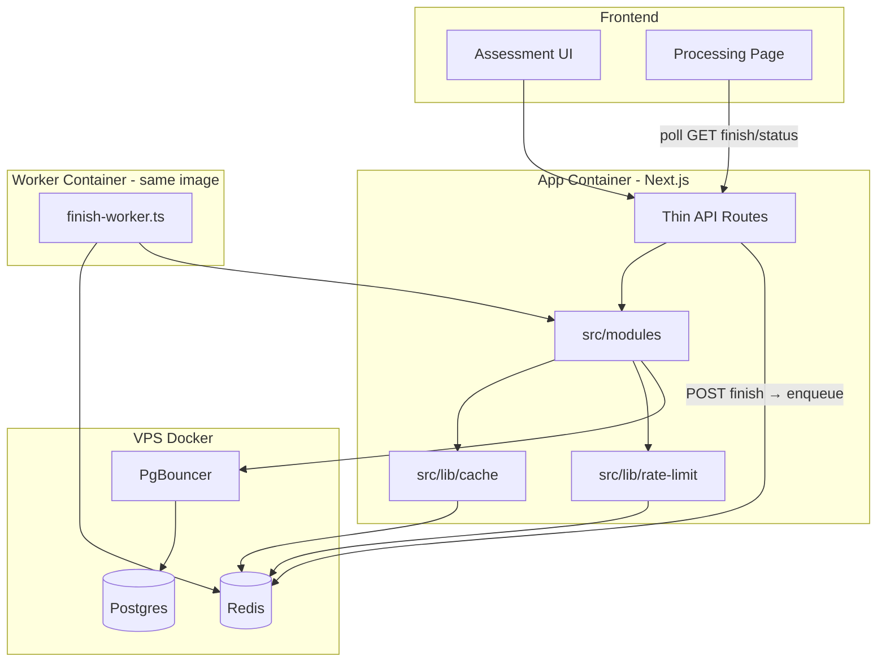
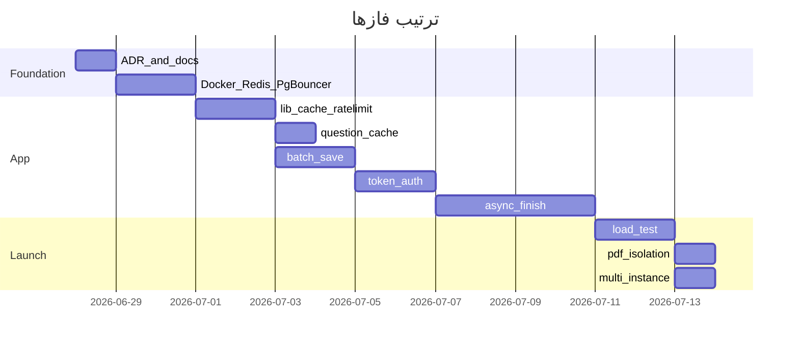

# پلن Scale — آماده‌سازی کمپین ۱۰۰ concurrent

## اصول محافظت از ساختار

این پلن **عمداً** با قوانین پروژه ([`.cursor/rules/project-rules.md`](.cursor/rules/project-rules.md), [ADR 0005](docs/adr/0005-use-modular-monolith.md)) هم‌راستاست:

- **Modular Monolith** — هیچ microservice جدا؛ worker فقط یک process/container دیگر از **همان repo و همان `src/modules`**
- **Route نازک** — auth، rate limit، status code در route/`src/lib`؛ منطق کسب‌وکار در `src/modules/*`
- **موتورهای core دست‌نخورده** — scoring، diagnosis، report builder، `persistAssessmentResults` refactor نمی‌شوند؛ فقط **نحوه فراخوانی** و **infra** عوض می‌شود
- **Feature flag با env** — dev بدون Redis/PgBouncer کار کند؛ production با container
- **تست اجباری** — هر تغییر در `finishAssessment` / save / access باید unit + integration test به‌روز شود



---

## Phase 0 — ADR و قرارداد API (قبل از کد)

**فایل جدید:** [`docs/adr/0014-scale-readiness-async-finish.md`](docs/adr/0014-scale-readiness-async-finish.md)

ثبت تصمیم‌ها (بدون نقض ADR 0005):
- Redis + PgBouncer = **infra layer**، نه سرویس جدا
- Worker container = **همان codebase**، CMD متفاوت
- Async finish = صف BullMQ روی Redis؛ core logic در `assessment.service.ts` extract می‌شود

**قرارداد API جدید (backward-compatible در یک deploy واحد):**

| Endpoint | رفتار جدید |
|----------|------------|
| `POST /api/assessments/[id]/finish` | `202` + `{ jobId, status: "queued" }` — اگر قبلاً complete → `200` همان response فعلی (idempotent) |
| `GET /api/assessments/[id]/finish` | polling: `{ status, reportId?, resultUrl?, error? }` |
| همه assessment endpoints | `token` اجباری (header `X-Assessment-Token` یا query `?token=`) |

**Env جدید** در [`.env.production.example`](.env.production.example):

```
REDIS_URL=redis://redis:6379
DATABASE_URL=postgresql://...@pgbouncer:6432/...?connection_limit=10
ASYNC_FINISH_ENABLED=true
PDF_GENERATION_ENABLED=false   # در کمپین
```

---

## Phase 1 — Infra: Docker + nginx (بدون تغییر منطق app)

**فایل‌ها:** [`docker-compose.nginx.yml`](docker-compose.nginx.yml), [`docker-compose.prod.yml`](docker-compose.prod.yml), [`deploy/nginx/health.javidmgdm.com.conf`](deploy/nginx/health.javidmgdm.com.conf)

### 1.1 سرویس‌های جدید

```yaml
redis:        # redis:7-alpine, volume, maxmemory-policy allkeys-lru
pgbouncer:    # edoburu/pgbouncer, pool_mode=transaction, max 100 conn
worker:       # همان image app, CMD: node scripts/finish-worker.js
              # depends_on: redis, pgbouncer, env: REDIS_URL, DATABASE_URL
```

- `app` و `worker` هر دو به `pgbouncer:6432` وصل شوند (نه مستقیم postgres)
- `postgres` فقط internal بماند
- memory limit روی `app` (512m–1g) و `worker` (1g) — PDF worker جدا (Phase 7)

### 1.2 nginx

در [`deploy/nginx/health.javidmgdm.com.conf`](deploy/nginx/health.javidmgdm.com.conf):

```nginx
proxy_read_timeout 120s;
proxy_connect_timeout 10s;
proxy_send_timeout 120s;
```

آماده‌سازی upstream برای Phase 8 (commented template برای 2 instance).

### 1.3 Health check گسترش‌یافته

[`src/app/api/health/route.ts`](src/app/api/health/route.ts): علاوه بر DB، ping Redis (optional — اگر `REDIS_URL` unset در dev، skip).

**مستندات:** [`docs/ops/scaling.md`](docs/ops/scaling.md) + به‌روزرسانی [`docs/ops/production-deploy.md`](docs/ops/production-deploy.md)

---

## Phase 2 — لایه infra مشترک در `src/lib` (جداسازی بدون شلوغی modules)

| فایل | مسئولیت |
|------|---------|
| [`src/lib/redis.ts`](src/lib/redis.ts) | singleton Redis client؛ lazy connect |
| [`src/lib/cache.ts`](src/lib/cache.ts) | interface `CacheStore` + `MemoryCacheStore` (dev) + `RedisCacheStore` (prod) |
| [`src/lib/rate-limit-store.ts`](src/lib/rate-limit-store.ts) | interface store برای sliding window |
| refactor [`src/lib/rate-limit.ts`](src/lib/rate-limit.ts) | factory: `createRateLimiter` از store استفاده کند؛ dev=in-memory، prod=Redis |
| [`src/lib/assessment-token.ts`](src/lib/assessment-token.ts) | extract `verifyResultToken` از service؛ helper `extractAssessmentToken(request)` |

**قانون:** modules به Redis مستقیم وصل نشوند — فقط از `cache` و `rate-limit` استفاده کنند.

**Rate limit جدید (کمپین-friendly):**

| Route | Limit پیشنهادی |
|-------|----------------|
| start | 5 / 10 min / IP |
| recover | 3 / 15 min / IP |
| consultation | 5 / hour / IP |
| finish enqueue | 3 / 10 min / assessmentId |
| pdf | 3 / hour / IP |

---

## Phase 3 — Cache سوالات (کاهش DB load)

**تغییر در:** [`src/modules/question-bank/question-bank.repository.ts`](src/modules/question-bank/question-bank.repository.ts) یا فایل جدید [`src/modules/question-bank/question-bank.cache.ts`](src/modules/question-bank/question-bank.cache.ts)

- wrap `loadDomainsWithQuestions` و `loadLayers` با cache key `model:${modelVersionId}:domains` / `:layers`
- TTL: 1 ساعت (model version rarely changes)
- invalidation: فقط با TTL (بدون پیچیدگی event)

**اثر:** `getAssessmentQuestions` و بخش read در `finishAssessment` از DB مشترک benefit می‌گیرند.

**تست:** unit test برای cache hit/miss با mock store.

---

## Phase 4 — Batch `saveAnswers` (همان API، کمتر query)

**تغییر در:**

- [`src/modules/assessment/assessment.repository.ts`](src/modules/assessment/assessment.repository.ts) — `upsertAnswersBatch(answers[])` در **یک `$transaction`**
- [`src/modules/question-bank/question-bank.service.ts`](src/modules/question-bank/question-bank.service.ts) — `validateAnswersBatch(questionIds[], modelVersionId)` با query تکی
- [`src/modules/assessment/assessment.service.ts`](src/modules/assessment/assessment.service.ts) — loop فعلی (خطوط 328–345) → batch call

**بدون تغییر:** validator schema، response shape، frontend payload.

**تست:** به‌روزرسانی [`src/tests/assessment/assessment.service.test.ts`](src/tests/assessment/assessment.service.test.ts)

---

## Phase 5 — Token auth روی assessment endpoints

**الگوی موجود:** `verifyResultToken` در [`assessment.service.ts`](src/modules/assessment/assessment.service.ts) (خط 173) — extract به [`src/lib/assessment-token.ts`](src/lib/assessment-token.ts)

**Service layer:** توابع زیر پارامتر `token` می‌گیرند و قبل از کار `verifyResultToken` می‌زنند:

- `saveAnswers`, `finishAssessment`, `enqueueFinish`, `getFinishStatus`
- `updateBusinessInfo`, `updateBusinessMetrics`
- `getAssessmentQuestions`, `getAssessmentAnswers`, `getAssessmentStatus`

**Routes:** token از `X-Assessment-Token` header (اولویت) یا `?token=` query.

**Frontend (تغییر متمرکز):**

- [`src/lib/api-client.ts`](src/lib/api-client.ts) — optional `token` param یا helper `apiPostWithToken`
- صفحات assessment از [`getResultToken`](src/lib/assessment-storage.ts) token را پاس دهند:
  - [`questions/[domainIndex]/page.tsx`](src/app/assessment/[id]/questions/[domainIndex]/page.tsx)
  - [`processing/page.tsx`](src/app/assessment/[id]/processing/page.tsx)
  - [`review/page.tsx`](src/app/assessment/[id]/review/page.tsx)
  - [`BusinessMetricsGate.tsx`](src/components/report/blocks/BusinessMetricsGate.tsx)

**تست:** integration tests در [`finish-assessment.integration.test.ts`](src/tests/integration/finish-assessment.integration.test.ts) — token required + 403 بدون token

---

## Phase 6 — Async finish queue (قلب scale)

### 6.1 Extract core (بدون تغییر منطق diagnostic)

در [`src/modules/assessment/assessment.service.ts`](src/modules/assessment/assessment.service.ts):

```typescript
// private — همان body فعلی finishAssessment (خط 480–557)
async function runFinishAssessmentCore(assessmentId: string): Promise<FinishAssessmentResponse>

export async function finishAssessment(...)  // sync path — فقط برای worker + idempotent fast-path
export async function enqueueFinishAssessment(assessmentId, token)
export async function getFinishJobStatus(assessmentId, token)
```

`runFinishAssessmentCore` همان `persistAssessmentResults` + locking فعلی را صدا می‌زند — **تست‌های scoring/diagnosis snapshot دست‌نخورده**.

### 6.2 Queue module

**فایل‌های جدید** (مرز module روشن):

- [`src/modules/assessment/finish-queue.types.ts`](src/modules/assessment/finish-queue.types.ts)
- [`src/modules/assessment/finish-queue.service.ts`](src/modules/assessment/finish-queue.service.ts) — BullMQ queue `assessment-finish`

Job payload: `{ assessmentId }` — token در enqueue validate می‌شود، در job ذخیره نمی‌شود.

### 6.3 API routes

- [`src/app/api/assessments/[assessmentId]/finish/route.ts`](src/app/api/assessments/[assessmentId]/finish/route.ts) — POST → enqueue یا 200 اگر complete
- **Route جدید:** `src/app/api/assessments/[assessmentId]/finish/route.ts` — GET برای status (یا `finish/status/route.ts`)

### 6.4 Worker

**فایل جدید:** [`scripts/finish-worker.ts`](scripts/finish-worker.ts)

- import `runFinishAssessmentCore` از service
- BullMQ worker با concurrency قابل تنظیم (`FINISH_WORKER_CONCURRENCY=3` default)
- retry: 2 بار با backoff
- failed job → status `failed` + Sentry

**Docker:** service `worker` در compose با همان image، بدون Playwright.

### 6.5 Frontend processing

[`src/app/assessment/[id]/processing/page.tsx`](src/app/assessment/[id]/processing/page.tsx):

1. POST finish → دریافت `202 queued`
2. poll `GET .../finish` هر 2s (max 90s)
3. on `completed` → redirect به result (همان `navigateToResult`)
4. on `failed` → retry button (همان UX فعلی)

**تست:**
- unit: finish-queue mock
- integration جدید: `src/tests/integration/async-finish.integration.test.ts` — enqueue → worker inline/process → completed
- تست idempotent موجود (P2002) همچنان pass

**Dependency:** `bullmq` + `ioredis` در [`package.json`](package.json)

---

## Phase 7 — PDF isolation (کمپین-safe)

- **default production:** `PDF_GENERATION_ENABLED=false`
- route [`src/app/api/reports/[reportId]/pdf/route.ts`](src/app/api/reports/[reportId]/pdf/route.ts): rate limit Redis + optional queue
- **optional compose profile `pdf`:** container جدا با `INSTALL_PLAYWRIGHT=true` که فقط PDF route serve کند (nginx path `/api/reports/*/pdf` → pdf container) — **بعد از کمپین**، نه blocker launch

به‌روزرسانی [`docs/ops/pdf-export.md`](docs/ops/pdf-export.md)

---

## Phase 8 — Multi-instance readiness (post-cache, pre-campaign)

- nginx upstream template برای 2× `app` روی portهای 3105/3106
- هر instance: `connection_limit=10` → max 20 conn via PgBouncer
- rate limit و queue از قبل Redis-backed — sticky session لازم نیست

---

## Phase 9 — Load test و معیار قبولی

**فایل‌های جدید:**

- [`loadtests/k6/full-assessment.js`](loadtests/k6/full-assessment.js) — سناریو: start → questions → 16× save → finish enqueue → poll → result
- [`docs/ops/load-test.md`](docs/ops/load-test.md)

**معیار قبولی قبل از ads:**

| Metric | Target |
|--------|--------|
| 100 VU browsing/saving | p95 < 2s |
| 20 concurrent finish jobs | p95 complete < 30s |
| Error rate | < 1% |
| DB connections | stable under PgBouncer max |

**CI (optional):** smoke load test در workflow جدا (nightly) — نه blocker PR

---

## Phase 10 — Monitoring و ops checklist

- Sentry alert rules (error rate, finish job failed)
- [`docs/ops/scaling.md`](docs/ops/scaling.md) — pre-campaign checklist:
  - backup restore test
  - Redis persistence (AOF)
  - `CAPACITY_MODE=free` در peak
  - Resend quota
- health endpoint: `{ status, db, redis, queueDepth? }`

---

## ترتیب اجرا و ریسک



**Deploy strategy:** هر phase یک PR جدا؛ Phase 5+6 در یک release deploy شوند (token + async با هم).

**چیزهایی که عمداً تغییر نمی‌کنند:**
- `src/modules/scoring/*`, `src/modules/diagnosis/*`, `src/modules/report/report.builder.ts`
- Prisma schema (به جز اگر بعداً audit table بخواهید — فعلاً Redis job کافی است)
- UX flow assessment (فقط processing → polling)

---

## تخمین زمان

| Phase | روز کاری |
|-------|----------|
| 0–1 Infra + ADR | 2–3 |
| 2–4 lib + cache + batch | 3–4 |
| 5 Token auth | 2 |
| 6 Async finish | 4–5 |
| 7–10 PDF + load test + docs | 3–4 |
| **جمع** | **~14–18 روز** |
