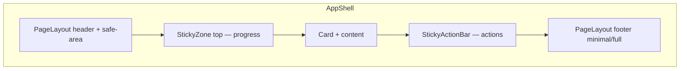

# پلن UX Design System — Assessment Flow

## اصل معماری

الگوی **دو zone چسبان** (بالا progress، پایین actions) روی shell موجود سوار می‌شود؛ backend و API دست نخورده.



**قوانین پروژه:**
- فقط primitives جدید در [`src/components/ui/`](src/components/ui/) — بدون inline card classes
- رنگ progress از token: `bg-brand-600` نه `bg-emerald-600` ([`ProgressBar.tsx`](src/components/assessment/ProgressBar.tsx))
- mobile-first، `env(safe-area-inset-*)` مثل [`StickyActionBar.tsx`](src/components/ui/StickyActionBar.tsx)
- print/PDF و `medium: print` دست نخورده
- PRهای کوچک و reviewable (۳ PR)

---

## وضعیت فعلی (پایه موجود)

| موجود | فایل |
|-------|------|
| Progress غیر-sticky | [`AssessmentShell.tsx`](src/components/layout/AssessmentShell.tsx) خط ۵۰ |
| Actions sticky پایین | [`StickyActionBar.tsx`](src/components/ui/StickyActionBar.tsx) |
| دو ProgressBar در questions | [`questions/.../page.tsx`](src/app/assessment/[id]/questions/[domainIndex]/page.tsx) |
| Review + لینک «تکمیل» دامنه ناقص | [`review/page.tsx`](src/app/assessment/[id]/review/page.tsx) خط ۱۹۸–۲۳۰ |
| TOC فقط desktop | [`ReportShell.tsx`](src/components/layout/ReportShell.tsx) `hidden lg:block` |
| `saving` state بدون indicator دائمی | questions page |

---

## Phase 1 — Sticky Progress + Layout Zones (بیشترین ROI)

### 1.1 Primitive: `StickyZone`

فایل جدید [`src/components/ui/StickyZone.tsx`](src/components/ui/StickyZone.tsx):

- prop `position: 'top' | 'bottom'`
- top: `sticky top-0 z-20 border-b bg-surface-raised/95 backdrop-blur pt-[env(safe-area-inset-top)]` — offset زیر header با `top` محاسبه‌شده (header ~۵۲px) یا slot داخل layout
- bottom: mirror الگوی `StickyActionBar` (در صورت نیاز unify بعداً)
- prop `variant?: 'default' | 'subtle'`

### 1.2 Composite: `AssessmentProgressHeader`

فایل جدید [`src/components/assessment/AssessmentProgressHeader.tsx`](src/components/assessment/AssessmentProgressHeader.tsx):

```tsx
interface AssessmentProgressHeaderProps {
  overall: { current: number; total: number; label?: string };
  domain?: { current: number; total: number; domainIndex: number; domainTotal: number; domainName?: string };
}
```

- bar کلی همیشه؛ bar دامنه اختیاری (questions)
- یک خط context: «دامنه X از Y — {domainName}»
- wrap در `StickyZone position="top"`

### 1.3 Refactor `ProgressBar`

[`ProgressBar.tsx`](src/components/assessment/ProgressBar.tsx):
- `bg-brand-600` به‌جای `bg-emerald-600`
- prop اختیاری `compact?: boolean` برای header (ارتفاع bar `h-1.5`)

### 1.4 تغییر `AssessmentShell`

[`AssessmentShell.tsx`](src/components/layout/AssessmentShell.tsx):

- prop جدید `stickyProgress?: ReactNode` — render داخل `StickyZone top` **بیرون** Card
- prop `progress` فعلی deprecate یا alias به `stickyProgress` (migrate callers)
- padding-bottom روی main وقتی sticky top+ bottom فعال: `pb-24` موبایل تا محتوا زیر bar نرود

### 1.5 Migrate callers

| Route | تغییر |
|-------|-------|
| [`questions/[domainIndex]/page.tsx`](src/app/assessment/[id]/questions/[domainIndex]/page.tsx) | `AssessmentProgressHeader` با overall + domain |
| [`review/page.tsx`](src/app/assessment/[id]/review/page.tsx) | فقط overall bar در sticky header |

### 1.6 Docs

به‌روزرسانی [`docs/frontend/design-system.md`](docs/frontend/design-system.md):
- بخش **Layout zones** (top progress / bottom actions)
- جدول primitives: `StickyZone`, `AssessmentProgressHeader`

**خروجی Phase 1:** progress هنگام scroll ۸۰ سوال همیشه visible.

---

## Phase 2 — Feedback و Assessment Flow Polish

### 2.1 `SaveStatusIndicator`

فایل [`src/components/assessment/SaveStatusIndicator.tsx`](src/components/assessment/SaveStatusIndicator.tsx):

- states: `idle` | `saving` | `saved` | `error`
- متن: «در حال ذخیره…» / «ذخیره شد» (fade بعد ۲s)
- قرارگیری: گوشه چپ sticky progress header (RTL-aware)

Wire در questions page: `saving` + `saveError` موجود → indicator؛ `saveError` همچنان `Alert`/`ErrorMessage` برای خطای جدی.

### 2.2 Review UX

[`review/page.tsx`](src/app/assessment/[id]/review/page.tsx) — بهبود جزئی (لیست از قبل لینک دارد):

- دکمه «دریافت نتیجه» disabled + زیر آن لینک «مشاهده N بخش ناقص» → `#incomplete-domains` (id روی Alert)
- row دامنه ناقص: کل row clickable (نه فقط «تکمیل»)
- status icon از health/success tokens (`bg-health-healthy-subtle`) نه raw emerald

### 2.3 Footer minimal در flow ارزیابی

[`PageLayout.tsx`](src/components/layout/PageLayout.tsx):

- prop `footer?: 'full' | 'minimal'` (default `full`)
- `minimal`: فقط «حریم خصوصی» — بدون recover (کاهش حواس‌پرتی)
- `AssessmentShell` → `footer="minimal"` برای questions + review + processing

**خروجی Phase 2:** اعتماد در save + navigation بهتر قبل finish.

---

## Phase 3 — Processing + Result + Report Nav

### 3.1 `ProcessingStepper`

فایل [`src/components/assessment/ProcessingStepper.tsx`](src/components/assessment/ProcessingStepper.tsx):

- ۳ step: امتیاز → تشخیص → گزارش
- prop `activeStep: 0 | 1 | 2` — از [`processing/page.tsx`](src/app/assessment/[id]/processing/page.tsx) با `messageIndex` map شود
- جایگزین/مکمل rotate text (متن rotate می‌تواند زیر stepper بماند)

### 3.2 `ResultStickySummary` (موبایل)

فایل [`src/components/report/ResultStickySummary.tsx`](src/components/report/ResultStickySummary.tsx):

- فقط `sm:hidden` یا `lg:hidden` — sticky top زیر header
- نمایش: `{percentage}%` + `HealthBadge` کوچک
- wire در [`result/page.tsx`](src/app/assessment/[id]/result/page.tsx) داخل `ReportShell`

### 3.3 Mobile TOC برای گزارش

[`ReportShell.tsx`](src/components/layout/ReportShell.tsx):

- زیر title، `lg:hidden`: horizontal scroll nav (`ReportMobileToc`) — chip links به `#section-id`
- desktop TOC موجود (`sticky top-8`) بدون تغییر رفتار

### 3.4 `ResultActionsBar` (اختیاری سبک)

sticky bottom موبایل در result: «گزارش کامل» + «کپی لینک» — reuse `StickyActionBar` + `LinkButton`/`Button`؛ PDF secondary.

**خروجی Phase 3:** perceived wait کمتر + navigation در صفحات طولانی result/report.

---

## Phase 4 — Polish و Accessibility (اختیاری post-MVP)

- **Skeleton:** variant `PageState skeleton="result"` — placeholder gauge/chart (بدون API change)
- **Scroll spy:** active TOC item در `ReportShell` با `IntersectionObserver` (client component کوچک)
- **`prefers-reduced-motion`:** حذف `transition-all` روی progress bar و `active:scale` در [`DomainQuestionForm.tsx`](src/components/assessment/DomainQuestionForm.tsx)
- **Manual QA:** سناریوی جدید در [`MVP-Manual-Test-Scenarios.md`](docs/qa/MVP-Manual-Test-Scenarios.md) — sticky progress visible بعد scroll، save indicator، review jump

---

## ترتیب وابستگی

```
Phase 1 StickyZone + AssessmentProgressHeader + Shell
    ↓
Phase 2 SaveStatus + Review polish + minimal footer
    ↓
Phase 3 ProcessingStepper + Result/Report nav
    ↓
Phase 4 a11y + skeleton + QA doc
```

## PR strategy

| PR | Scope |
|----|-------|
| **PR 1** | Phase 1 — sticky progress + ProgressBar tokens + design-system docs |
| **PR 2** | Phase 2 — save indicator, review polish, minimal footer |
| **PR 3** | Phase 3 — processing stepper, result sticky summary, mobile TOC |
| **PR 4** (optional) | Phase 4 — a11y, skeleton, QA scenario |

## معیار Done

- [ ] Progress در questions/review هنگام scroll sticky و زیر header نمی‌رود
- [ ] safe-area روی iOS در top/bottom zones
- [ ] `ProgressBar` از `brand-600` token
- [ ] Save indicator در questions (saved/saving/error)
- [ ] Review: disabled finish + jump به incomplete list
- [ ] Assessment routes: footer minimal
- [ ] Processing: visual stepper
- [ ] Result: sticky score موبایل؛ report TOC در موبایل
- [ ] `npm test` + `npm run lint` + `npm run build` سبز
- [ ] [`design-system.md`](docs/frontend/design-system.md) بخش Layout zones به‌روز

## ریسک‌ها

| ریسک | Mitigation |
|------|------------|
| double sticky offset (header + progress) | یک `top` ثابت در CSS variable `--header-height` در PageLayout |
| محتوا زیر sticky bars | padding-bottom موبایل در AssessmentShell |
| z-index conflict | top=20, bottom=10 — documented در StickyZone |
