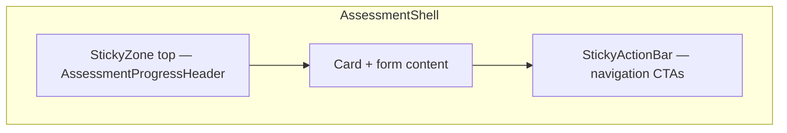
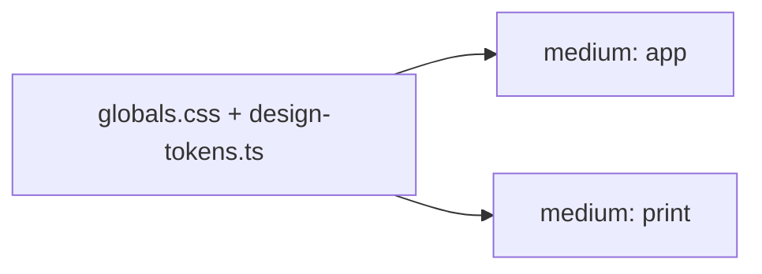

# Design System

Sales Health Check uses a single token layer for the **app** (mobile-first) and **print/PDF** surfaces. Tokens live in CSS for Tailwind utilities and in TypeScript for charts, inline styles, and future print stylesheets.

## Source of truth

| Layer | File | Purpose |
|-------|------|---------|
| CSS tokens | `src/app/globals.css` (`@theme inline`) | Tailwind utilities (`bg-brand-600`, `text-health-critical-emphasis`, …) |
| TS tokens | `src/lib/design-tokens.ts` | Hex values, class maps, `var(--color-*)` helpers |
| Health UI | `src/lib/health-colors.ts` | Badge/bar class helpers + re-exports for print |
| Report UI | `src/lib/report-ui.ts` | Survival banners, tone accents, domain bar colors, labels |

**Rule:** When changing a color, update both `globals.css` and `COLOR_TOKENS` in `design-tokens.ts` so app and print stay aligned.

## Palette

### Brand

Emerald is the primary brand accent (links, section labels, CTAs).

| Token | Hex | Tailwind |
|-------|-----|----------|
| `brand-600` | `#059669` | `text-brand-600`, `bg-brand-600` |
| `brand-700` | `#047857` | `text-brand-700` |
| `brand-800` | `#065f46` | `text-brand-800` |

### Surfaces & borders

| Token | Hex | Usage |
|-------|-----|-------|
| `surface` | `#fafafa` | Page background (`body`, `PageLayout`) |
| `surface-raised` | `#ffffff` | Cards, header/footer |
| `border` | `#e4e4e7` | Dividers, card borders |
| `border-subtle` | `#f4f4f5` | Lighter separators |
| `foreground` | `#18181b` | Primary text |
| `foreground-muted` | `#71717a` | Secondary text |

### Health levels

Four semantic levels map to the diagnostic score model (`critical` → `healthy`).

| Level | Bar | Badge background | Badge text | Ring |
|-------|-----|------------------|------------|------|
| critical | `#ef4444` | `#fee2e2` | `#991b1b` | `#fecaca` |
| weak | `#f97316` | `#ffedd5` | `#9a3412` | `#fed7aa` |
| medium | `#f59e0b` | `#fef3c7` | `#92400e` | `#fde68a` |
| healthy | `#10b981` | `#d1fae5` | `#065f46` | `#a7f3d0` |

Tailwind examples:

- Bar: `bg-health-critical`
- Badge: `bg-health-critical-subtle text-health-critical-emphasis ring-health-critical-ring`

In TypeScript:

```ts
import { healthLevelBarColor, healthBarHex, healthBarColorVar } from "@/lib/health-colors";

healthLevelBarColor("weak"); // → "bg-health-weak"
healthBarHex("weak");        // → "#f97316"
healthBarColorVar("weak");   // → "var(--color-health-weak)"
```

### Survival banner (RED / AMBER / GREEN)

| Status | Border | Background | Tailwind |
|--------|--------|------------|----------|
| RED | `#fecaca` | `#fef2f2` | `border-survival-red-border bg-survival-red-bg` |
| AMBER | `#fde68a` | `#fffbeb` | `border-survival-amber-border bg-survival-amber-bg` |
| GREEN | `#a7f3d0` | `#ecfdf5` | `border-survival-green-border bg-survival-green-bg` |

Use `SURVIVAL_BANNER_CLASS` or `SURVIVAL_BANNER_COLORS` from `@/lib/report-ui`.

### Tone accents

Report copy tone drives label color:

| Tone | Hex | Class |
|------|-----|-------|
| urgent | `#991b1b` | `text-tone-urgent` |
| serious | `#92400e` | `text-tone-serious` |
| optimization | `#065f46` | `text-tone-optimization` |
| honesty | `#3f3f46` | `text-tone-honesty` |

## Typography

- **Font:** Vazirmatn (loaded in root layout), exposed as `--font-sans` / `font-sans`
- **Direction:** RTL throughout the app
- **Scale:** Page titles `text-2xl sm:text-3xl`; body `text-base leading-7`; labels `text-sm font-medium`

## Radius & spacing

| Token | Value | Typical use |
|-------|-------|-------------|
| `radius-card` | `1rem` | Cards (`rounded-card` ≈ `rounded-2xl`) |
| `radius-button` | `9999px` | Buttons, badges (`rounded-button`) |
| `spacing-card` | `1.5rem` | Card padding mobile |
| `spacing-card-lg` | `2rem` | Card padding `sm+` |

Use the `Card` primitive (`src/components/ui/Card.tsx`) for new and migrated pages — it maps to `rounded-2xl`, white surface, and default padding. Legacy inline card classes on unmigrated routes are acceptable until fully migrated.

## Layout zones

Assessment flow pages use a **two-zone sticky pattern**: progress at the top, actions at the bottom. Both zones respect iOS safe areas and sit outside the main `Card` content.



| Zone | Component | z-index | Behavior |
|------|-----------|---------|----------|
| Top progress | `StickyZone position="top"` | 20 | Sticks below the page header (`--header-height` on `PageLayout`); opaque `bg-surface-raised` so content does not show through |
| Bottom actions | `StickyActionBar` → `StickyZone position="bottom" mode="fixed"` | 20 | Fixed to viewport bottom on all breakpoints |

**Header offset:** `PageLayout` sets `--header-height: calc(env(safe-area-inset-top) + 3.25rem)` and keeps the site header `sticky top-0 z-30`. Top zones use `top-[var(--header-height)]` so progress never slides under the header.

**Scroll offset:** `PageLayout` also sets `--assessment-progress-height` and `--assessment-scroll-offset` for auto-scroll after answer selection (`DomainQuestionForm` fieldsets and `#assessment-actions` sentinel).

**Content clearance:** When fixed bottom actions are active, `AssessmentShell` adds `pb-[calc(5rem+env(safe-area-inset-bottom))]` on the content wrapper so form content and footer are not hidden behind the bottom bar.

**Progress color:** Use `bg-brand-600` on progress bars (see `ProgressBar`), not raw `emerald-*`.

## Medium rules (app vs print)

One design system, two presentation modes:



### App (`medium: app`)

- Mobile-first layout with `PageLayout`, sticky action bars, collapsible sections
- Interactive elements: forms, CTAs, copy link, expert view
- Token-backed Tailwind classes in components

### Print / PDF (`medium: print`)

- Fixed viewport (~A4 / 1200px), multi-column where helpful
- All domains expanded; no nav, sticky bars, or interactive widgets
- CSS variables from `@theme` in `src/styles/print.css`, e.g. `background: var(--color-health-weak)`
- For Recharts and inline SVG fills, use hex helpers: `healthBarHex`, `domainLevelBarHex`, `SURVIVAL_BANNER_COLORS`

## Usage in components

**Prefer tokens over raw Tailwind palette names** for health, survival, and brand colors:

```tsx
// Good
<p className="text-brand-700">...</p>
<div className={healthLevelBarColor(level)} />

// Avoid in new code
<p className="text-emerald-700">...</p>
<div className="bg-red-500" />
```

Legacy `emerald-*` / `zinc-*` usage on unmigrated pages is acceptable until Phase 3 migration.

## UI primitives

| Component | File | Use |
|-----------|------|-----|
| `Card` | `src/components/ui/Card.tsx` | Raised surfaces (default / compact / spacious padding) |
| `Input`, `Select`, `Textarea`, `FieldLabel` | `src/components/ui/` | Forms (start, recover, consultation) |
| `Button` | `src/components/ui/Button.tsx` | Primary / secondary / ghost; `loading` + `loadingLabel` |
| `Alert` | `src/components/ui/Alert.tsx` | Warnings, save errors |
| `LinkButton` | `src/components/ui/LinkButton.tsx` | Inline navigation CTAs |
| `SectionHeader` | `src/components/ui/SectionHeader.tsx` | Emerald label + title pattern |
| `StickyZone` | `src/components/ui/StickyZone.tsx` | Sticky top/bottom layout bands (progress, optional bottom unify) |
| `StickyActionBar` | `src/components/ui/StickyActionBar.tsx` | Mobile sticky footer actions |
| `AssessmentProgressHeader` | `src/components/assessment/AssessmentProgressHeader.tsx` | Sticky overall + optional domain progress for assessment routes |
| `ProgressBar` | `src/components/assessment/ProgressBar.tsx` | Token-backed progress bar (`bg-brand-600`); `compact` for headers |

**Rule:** New pages and migrated routes use primitives only — no inline `rounded-2xl bg-white p-6` card classes.

## Report presentation

Report blocks accept `medium?: 'app' | 'print'` (default `'app'`):

| Mode | Entry | Behavior |
|------|-------|----------|
| App | `ReportSpecView` | Collapsible domains, interactive CTAs, sticky nav context |
| Print / PDF | `ReportPrintView` via `/report/[id]/print` | `renderReport(spec, { medium: 'print' })` — all domains expanded, `hideInteractive: true` |

`HealthGauge` bar color comes from `healthLevelBarColor(level)`, not a fixed emerald bar.

## Related files

- `src/components/layout/PageLayout.tsx` — app shell, safe-area, footer links
- `src/lib/design-tokens.ts` — TS mirror of CSS tokens
- `src/lib/report-ui.ts` — report-specific labels and survival styling
- `src/styles/print.css` — A4 page breaks, print color (imported on print route only)
- `src/app/report/[reportId]/print/page.tsx` — server-rendered print layout for browser preview and PDF capture
- `src/components/report/DownloadReportPdf.tsx` — download button on result + report pages
