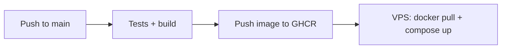

# Production deploy (VPS + Docker + Caddy)

Deploy the Sales Health Check stack on a personal VPS with HTTPS via [Caddy](https://caddyserver.com/) and PostgreSQL in Docker.

## Prerequisites

- VPS with Docker and Docker Compose v2
- Domain name with DNS **A record** pointing to the server public IP
- Ports **80** and **443** open in the firewall (app port 3000 stays internal to Docker)

## 1. Server setup

Clone the repo on the VPS:

```bash
git clone <repo-url> sales-health-check
cd sales-health-check
```

Copy and edit production environment:

```bash
cp .env.production.example .env
```

Required variables:

| Variable | Description |
|----------|-------------|
| `POSTGRES_PASSWORD` | Strong database password |
| `APP_DOMAIN` | Public hostname (e.g. `sales.example.com`) |
| `EXPERT_VIEW_TOKEN` | Secret for `/expert/[id]?adminToken=` in production |
| `APP_BASE_URL` | Full public URL (`https://sales.example.com`) — used for result links and email recovery |
| `CAPACITY_MODE` | `free` (default) or `full` — report CTA routing |

Optional (Phase 2 email recovery):

| Variable | Description |
|----------|-------------|
| `RESEND_API_KEY` | Resend API key |
| `EMAIL_FROM` | Verified sender (e.g. `noreply@yourdomain.com`) |

Generate a strong expert token:

```bash
openssl rand -hex 32
```

## 2. DNS

Create an **A record** for `APP_DOMAIN` → VPS public IP. Wait for propagation before the first deploy (Caddy needs HTTP-01 for Let's Encrypt).

## 3. Firewall

Allow inbound HTTP/HTTPS only:

```bash
# ufw example
sudo ufw allow OpenSSH
sudo ufw allow 80/tcp
sudo ufw allow 443/tcp
sudo ufw enable
```

Do **not** expose PostgreSQL (5432) or the app container (3000) to the public internet.

## 4. Build and start

```bash
docker compose -f docker-compose.prod.yml up -d --build
```

This starts:

- **postgres** — database with healthcheck
- **app** — Next.js (internal port 3000, runs migrations + seed on start)
- **caddy** — reverse proxy with automatic HTTPS → `app:3000`

The entrypoint runs `prisma migrate deploy` and seeds only if no active model exists.

## 5. Verify

```bash
# Stack status
docker compose -f docker-compose.prod.yml ps

# App health (via Caddy)
curl -sS "https://${APP_DOMAIN}/api/health"
# Expected: {"status":"ok"}

# Expert view gate (wrong token → 401)
curl -sS -o /dev/null -w "%{http_code}\n" \
  "https://${APP_DOMAIN}/expert/<assessment-id>?adminToken=wrong"
```

Open `https://<APP_DOMAIN>` in a browser and run manual QA: [MVP-Manual-Test-Scenarios.md](../qa/MVP-Manual-Test-Scenarios.md).

## 6. Update deployment

```bash
git pull
docker compose -f docker-compose.prod.yml up -d --build
```

For the **nginx + GHCR** path (recommended on multi-project VPS), see [Deploy with host nginx](#deploy-with-host-nginx-multi-project-vps) below — updates are `docker pull` only, no rebuild on the server.

## Architecture

```
Internet :443/:80
    → caddy (TLS, Let's Encrypt)
    → app:3000 (Next.js)
    → postgres:5432 (internal only)
```

- **Health:** `GET /api/health` — returns `200` with `{ "status": "ok" }` when the app and database are reachable; `503` if the database is down.
- **Optional direct app access:** bind `127.0.0.1:3000` on the host for local debugging by setting `APP_PORT=3000` in `.env` (see `docker-compose.prod.yml`).

## Troubleshooting

| Issue | Check |
|-------|--------|
| Caddy won't get certificate | DNS A record, ports 80/443 open, correct `APP_DOMAIN` |
| App unhealthy | `docker compose -f docker-compose.prod.yml logs app` |
| Database connection | Postgres container healthy; `DATABASE_URL` built from `.env` |
| 401 on expert view | Set `EXPERT_VIEW_TOKEN` in `.env` and restart app |

## 7. Database backup

Before the first real users, enable automated backups:

```bash
chmod +x scripts/backup-db.sh
./scripts/backup-db.sh
```

Configure daily cron and restore procedures: [database-backup.md](./database-backup.md).

## Deploy with host nginx (multi-project VPS)

Use this when the VPS already runs **nginx** on ports 80/443 for other projects (no Caddy).

### Stack

- **postgres** + **app** only — see [`docker-compose.nginx.yml`](../../docker-compose.nginx.yml)
- App image built in **GitHub Actions** and stored on **GHCR** (`ghcr.io/javid1371/sales-health-check`)
- App bound to `127.0.0.1:${APP_PORT:-3105}` on the host
- Host nginx reverse-proxies the public domain → localhost port
- SSL via **certbot** (same pattern as other subdomains on the server)

### CI/CD flow



On every push to `main`, GitHub Actions runs tests, builds the Docker image, and pushes tags `latest` and `<git-sha>` to GHCR. If repository secrets are set, the deploy job SSHs to the VPS and runs the update script.

### GitHub setup (one time)

1. **Actions permissions:** Settings → Actions → General → Workflow permissions → **Read and write**
2. **Private GHCR:** Keep the package private. Create a PAT and configure pull access — step-by-step: **[ghcr-private-setup.md](./ghcr-private-setup.md)**
3. **Auto-deploy secrets** (Settings → Secrets → Actions):

| Secret | Example | Purpose |
|--------|---------|---------|
| `GHCR_TOKEN` | `ghp_...` (classic PAT) | Pull private images on VPS during deploy |
| `VPS_SSH_HOST` | `root@193.163.201.132` | SSH target (optional — skip auto-deploy if unset) |
| `VPS_SSH_KEY` | private key contents | Deploy job authentication |

Optional repository variable: `PDF_GENERATION_ENABLED=true` — bakes Playwright into the CI-built image.

### First-time bootstrap (server)

```bash
chmod +x scripts/bootstrap-vps.sh scripts/deploy-to-vps.sh
# If GHCR package is private:
GHCR_TOKEN=ghp_xxx ./scripts/bootstrap-vps.sh root@193.163.201.132
# Public package:
./scripts/bootstrap-vps.sh root@193.163.201.132
```

Bootstrap syncs compose/scripts, creates `.env` with generated secrets, pulls the image from GHCR, starts Docker, installs nginx site config, and runs certbot.

Override certbot email: `CERTBOT_EMAIL=you@example.com ./scripts/bootstrap-vps.sh`

### Routine deploy (manual, ~1–2 min)

After CI has pushed a new image to GHCR:

```bash
./scripts/deploy-to-vps.sh root@193.163.201.132
# Pin a specific build:
./scripts/deploy-to-vps.sh root@193.163.201.132 abc1234def5678
```

This syncs only `docker-compose.nginx.yml`, `scripts/vps-update.sh`, and nginx config — then `docker compose pull` + restart. **No local Docker build, no image scp.**

### Manual steps (server)

```bash
cd /opt/sales-health-check
cp .env.production.example .env   # edit secrets; set APP_IMAGE
docker login ghcr.io   # if package is private
bash scripts/vps-update.sh

cp deploy/nginx/health.javidmgdm.com.conf /etc/nginx/sites-available/
ln -sf /etc/nginx/sites-available/health.javidmgdm.com.conf /etc/nginx/sites-enabled/
nginx -t && systemctl reload nginx
certbot --nginx -d health.javidmgdm.com
```

### Architecture (nginx variant)

```
Internet :443/:80
    → nginx (host, TLS via certbot)
    → 127.0.0.1:3105 (Docker app from GHCR)
    → postgres:5432 (internal only)
```

### Update (nginx variant)

```bash
./scripts/deploy-to-vps.sh
# or on server:
cd /opt/sales-health-check && bash scripts/vps-update.sh
```

## Related

- [README.md](../../README.md) — local dev and quick deploy
- [database-backup.md](./database-backup.md) — backup cron, retention, restore test
